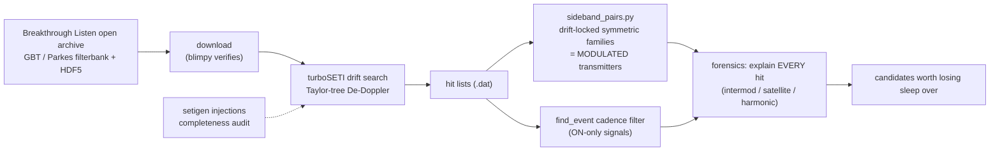

# setiTuna 🛸 — a backyard SETI rig on Breakthrough Listen open data

Hunt for technosignatures in public data from the world's biggest telescopes —
no dish required. Validated by detecting **Voyager 1** (carrier + both telemetry
sidebands, SNR 245, drift −0.38 Hz/s) in Green Bank open data, then re-finding
it **by structure alone** with our sideband-pair search.

## What's here
- `sideband_pairs.py` — the search nobody else runs: post-process turboSETI hit
  lists for **symmetric sideband families sharing a common drift** — the
  signature of a *modulated transmitter* (data!), not just a dead carrier.
  Validated: given three anonymous hits, it autonomously flagged Voyager as
  `TRIPLET ... carrier + data sidebands: a TRANSMITTER`.
- `IDEAS.md` — the novel-search roadmap (drift curvature, anti-cadence beacons,
  complexity scans, RFI forensics).

## Architecture

## Honesty rails
Every hit gets *explained*, not thresholded away. Completeness measured by
synthetic injection. Negative results published. The one confirmed
interstellar-distance technosignature (Voyager 1) is the standing calibration.

Data files are not in the repo (`data/` is gitignored) — fetch from the
[BL open archive](http://seti.berkeley.edu/opendata).
