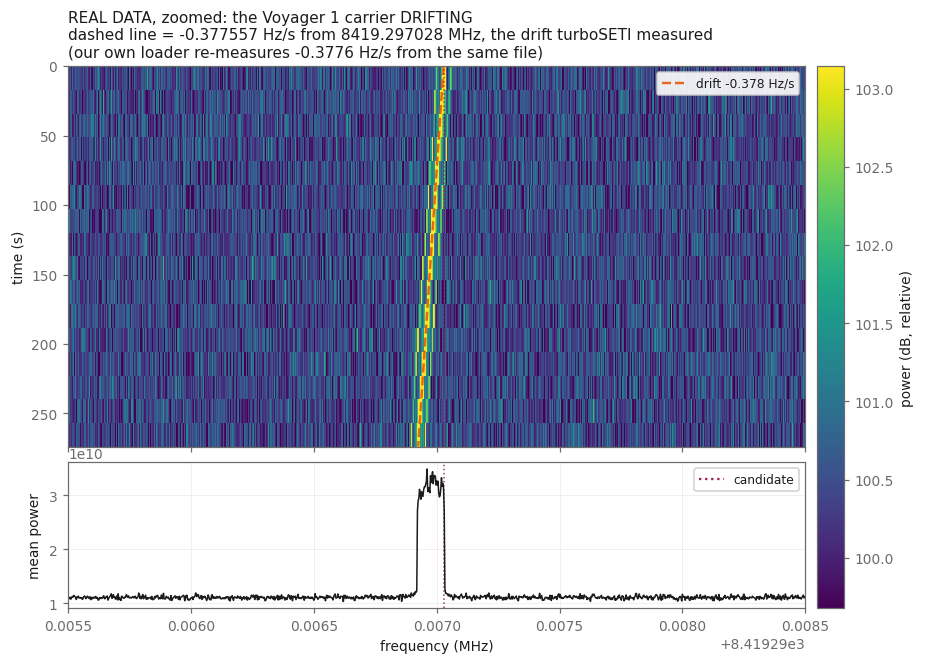
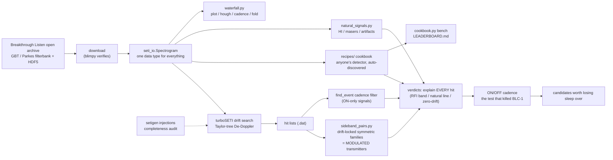

# setiTuna 🛸 — a backyard SETI rig on Breakthrough Listen open data

Hunt for technosignatures in public data from the world's biggest telescopes —
no dish required. Validated by detecting **Voyager 1** (carrier + both telemetry
sidebands, SNR 245, drift −0.38 Hz/s) in Green Bank open data, then re-finding
it **by structure alone** with our sideband-pair search.



*Real data, real drift: Voyager 1's X-band carrier (8421.39 MHz) from ~20 billion km
— 136 AU, its distance when this file was recorded on 2016-09-19 (MJD 57650.78,
straight out of the header) — sweeping
−0.3776 Hz/s. Our own loader re-measures the drift rate turboSETI reported for
this file to four decimal places. This is the only confirmed
interstellar-distance technosignature anyone has, and it is the standing
calibration for everything below.*

## What's here

**The searches**
- `star_sweep.py` — **point it at a list of nearby stars and walk away.** For
  each target it queries the BL archive, pulls the data, runs turboSETI's drift
  search, and applies RFI forensics (a real signal drifts at *varied* rates;
  interference sits at one). Writes a verdict table. Swept 6 neighbors incl.
  Barnard's Star and Tau Ceti — all RFI, zero candidates (`SWEEP_RESULTS.md`).
- `sideband_pairs.py` — the search nobody else runs: post-process turboSETI hit
  lists for **symmetric sideband families sharing a common drift** — the
  signature of a *modulated transmitter* (data!), not just a dead carrier.
  Validated: given three anonymous hits, it autonomously flagged Voyager as
  `TRIPLET ... carrier + data sidebands: a TRANSMITTER`.

**The novel detectors** (the ones turboSETI is structurally blind to)
- `cyclo.py` — **the frontier: a detector for signals turboSETI cannot see.**
  A drift search only finds loud narrowband *carriers* — radio like 1950s Earth.
  Anyone slightly ahead of us transmits *spread-spectrum* that looks like pure
  noise in the spectrum. `cyclo.py` catches it via the cyclic autocorrelation:
  it detected a spread signal at **−10 dB SNR (invisible to any spectrum search)
  with zero false alarms** (`CYCLO_RESULT.md`). `python cyclo.py selftest`.
- `comb.py` — **frequency-comb** detector: fires on uniform Hz-spaced tones (an
  engineered reference nature doesn't fake), silent on the same count of randomly
  spaced tones (`COMB_RESULT.md`). `entropy.py` — **compressibility** detector:
  a carrier is boring (compresses to nothing), noise is structureless, a *message*
  is the middle; scores it by spectral flatness (`ENTROPY_RESULT.md`).
- `agent.py` — **the ensemble**: runs the whole novel-detector panel (cyclo +
  comb + entropy) on a capture and reports which fire. `python agent.py selftest`
  regression-gates all three at once.
- `NOVEL_DETECTORS.md` / `IDEAS.md` — why past SETI probably looked for the
  wrong thing, and the roadmap of detectors nobody runs.

**The recipe cookbook** — *invent your own way to find aliens*
- `recipe_api.py` + `cookbook.py` + `recipes/` — a plugin format so **anyone
  (human or LLM) can contribute a detector**: one small python file, declared
  interface, auto-discovered, runnable from the CLI, scored against everyone
  else's on the same public data. Six shipped examples, from the reference
  narrowband-drift search to a deliberately playful (but genuinely
  Doppler-invariant) π-ratio hunter. **Start here: [RECIPES.md](RECIPES.md)**,
  and see who's winning in [LEADERBOARD.md](LEADERBOARD.md).

**Seeing it**
- `waterfall.py` — spectrograms with the physics drawn on top: drift-rate lines,
  the FRB dispersion sweep, candidate markers, log-frequency, bandpass removal.
  Plus two views standard SETI tools don't give you — the **drift-rate/frequency
  plane** (`hough`) and the **ON/OFF cadence strip** (`cadence`) — and a pulsar
  `fold`. `python waterfall.py figures` regenerates every figure in these docs.
- `seti_io.py` — one data type for everything: BL HDF5, SIGPROC filterbank, raw
  IQ from your own SDR, and physically-correct synthetic scenes so nothing needs
  a download.

**Knowing what you're looking at**
- **[SETI_HISTORY.md](SETI_HISTORY.md)** — the real history (Ozma, the Wow!
  signal, SERENDIP/SETI@home, Breakthrough Listen, the ATA), the candidate events
  and how each was explained, and — the useful part — **a catalogue of the natural
  phenomena SETI actually finds instead of aliens**, with the signature each one
  leaves in a waterfall, and an honest account of what a hobbyist can and cannot
  detect. Including the truthful answer about black holes.
- `natural_signals.py` — finds that astrophysics in *your* downloads: measures the
  galaxy's 21 cm hydrogen line, converts it to a proper LSR velocity, separates
  sky features from instrument features, and fingerprints the spectrometer's own
  artifacts.
- `fetch_public_data.py` — where to get real data showing each phenomenon. Fetch
  scripts only; no third-party data ships in this repo.

## Quickstart — hunt for aliens yourself
```bash
pip install -r requirements.txt          # numpy, scipy, turbo_seti, blimpy, h5py...
python agent.py selftest                 # prove all 3 novel detectors work (no data)
python cookbook.py selftest              # prove all 6 recipes work (no data)
python cookbook.py bench                 # score every recipe, rewrite the leaderboard
python cookbook.py run all synth:drift   # run the whole panel on a synthetic scene
python star_sweep.py GJ699 GJ411 GJ71    # sweep real stars from the BL open archive
python natural_signals.py data/*.h5      # find the galaxy's hydrogen in your data
python waterfall.py figures              # regenerate every figure in these docs
```
`star_sweep.py` needs `curl` on PATH (ships with Windows 10+/macOS/Linux). The
BL archive is free and public: <http://seti.berkeley.edu/opendata>. Each target
pulls ~0.2–0.3 GB into `data/` (gitignored) and deletes it after the hunt.

### Getting the data (this repo ships none)

**No telescope data is in this repository and none ever will be** — it is other
people's data, it is enormous, and it is already free. `data/` is gitignored.
Everything below downloads from the public Breakthrough Listen archive into that
folder, and every script here expects to find it there.

**Where it goes:** `setiTuna/data/`. Create it if it does not exist; the fetchers
create it for you. Nothing else needs configuring — the tools glob that folder.

**Step by step, from nothing to a real search:**

```bash
# 0. one-time setup
pip install -r requirements.txt
pip install hdf5plugin                  # REQUIRED: BL files are bitshuffle-
                                        # compressed. Without it h5py fails with
                                        # a cryptic "can't open directory".

# 1. prove the software works before spending a single byte of bandwidth
python cookbook.py selftest             # every recipe, no data needed
python cookbook.py bench                # scores them on synthetic scenes

# 2. smallest possible real file (~50 MB): Voyager 1, the standing calibration.
#    A real spacecraft carrier at interstellar distance — if your pipeline
#    cannot find THIS, it cannot find anything.
python fetch_public_data.py voyager
python cookbook.py run all data/Voyager1.single_coarse.fine_res.h5

# 3. a single pointing at a nearby star (~0.2 GB)
python fetch_public_data.py bl --target GJ699        # Barnard's Star
python cookbook.py run all data/star_GJ699.h5

# 4. THE REAL TEST: a full ON/OFF cadence (~77 GB, allow ~40 min).
#    Six scans: target, blank sky, target, blank sky, target, blank sky.
python fetch_cadence.py --target GJ699 --n 6 --dry-run   # check size FIRST
python fetch_cadence.py --target GJ699 --n 6             # then pull it
python cadence_search.py --target GJ699 --f-start 1400 --f-stop 1500

# 5. record what you covered, so a null result means something
python search_ledger.py coverage
```

**Pick a target:** `python -c "import tools.setituna_mcp"` is not needed — just
query the archive by name. Good nearby ones: `GJ699` (Barnard's Star, 6 ly),
`GJ411`, `GJ15A`, `GJ273` (Luyten's Star), `GJ581`. Any BL target name works.

**Reading the result.** `cadence_search.py` prints `ON-only survivors`. Zero is
the normal, correct, honest answer and it is what everyone who has ever done this
has gotten. A survivor is **not** a detection — it is something not yet
explained, which is a much weaker claim. Before believing one:

1. Is its drift exactly `0.000` Hz/s? Then it is bolted to the ground with you.
   A sky source *must* Doppler-drift; Earth's rotation alone gives 0.05–0.3 Hz/s
   at L band.
2. Is it on a round number, or in a band in `recipe_api.RFI_BANDS`? Aircraft
   telemetry, GPS, Iridium and satellite downlinks produce beautiful candidates.
3. Does it appear in **all** the ON scans? Intermittent interference shows up in
   one and looks exactly like a discovery.
4. Is it absurdly narrow? A 5.7 Hz feature at 1.4 GHz is a fractional bandwidth
   of 4e-9. Nothing astrophysical is that monochromatic — that is a machine,
   ours or somebody's.

BLC-1, the best modern SETI candidate, passed more checks than anything you will
find here and was still local interference (Sheikh et al. 2021, *Nature
Astronomy* 5, 1153). Assume the same and try hard to kill your own hit.

**Disk and time budget:** one fine-frequency scan is ~12.8 GB and covers the
whole 750 MHz L-band at 2.836 Hz — 264,503,296 channels, 16 integrations of
18 s, 288 s total. A six-scan cadence is ~77 GB. A 100 MHz search across all six
takes about 14 minutes on a GPU, a few hours on CPU. The files are gitignored;
delete them when you are done.

## What's actually in the data (real results, from files on disk)

Every SETI observation is full of the universe. Point our tools at the same
Green Bank files we used to hunt for aliens around nearby stars, and the
**galaxy's own neutral hydrogen** is sitting right there at 1420.4 MHz:


| pointing | galactic *l*, *b* | HI velocity (LSR) | peak / continuum | significance |
|---|---|---|---|---|
| GJ699 (Barnard's Star) | 31°, +14° | **+3.0 km/s** | ×1.56 | 814 σ |
| GJ273 (Luyten's Star) | 212°, +10° | **+20.6 km/s** | ×1.36 | 233 σ |
| GJ411 (Lalande 21185) | 185°, **+65°** | −77 km/s (weak, uncertain) | ×1.11 | 116 σ |

That is the sky, not the receiver, and you can prove it two ways: the line
**moves** with galactic longitude (a fixed instrumental artifact could not), and
it **fades** at high galactic latitude where there is less gas to see — GJ411
looks out of the galaxy at *b* = +65° and the line nearly vanishes. Reproduce
with `python natural_signals.py data/star_*.h5 --figure figures/hi_survey.png`.
The same run measures the spectrometer's own artifacts honestly: GBT's coarse
channels every **2.930 MHz**, 270–327 band-edge dips per file, all instrument.

And here is the shape-recognition guide for everything else — what each
phenomenon *looks like* in a waterfall, generated from the formulae quoted in
[SETI_HISTORY.md](SETI_HISTORY.md):


## Architecture


## Honesty rails
Every hit gets *explained*, not thresholded away — `recipe_api.explain()` attaches
a verdict (known-RFI band, natural spectral line, zero drift, band edge, or
"unexplained — worth a human") to every candidate any recipe produces. Detectors
are gated on **false alarms in pure noise** before anything else: a detector that
fires on noise has found nothing. Completeness measured by synthetic injection.
Negative results published. The one confirmed interstellar-distance
technosignature (Voyager 1) is the standing calibration.

Data files are not in the repo (`data/` is gitignored) — fetch from the
[BL open archive](http://seti.berkeley.edu/opendata) with `star_sweep.py` or
`fetch_public_data.py`.

## Hardware and GPU
None required. setiTuna analyses archive data — no telescope, no SDR, no dish.
Any laptop runs everything here; the selftests and every teaching figure need no
download at all. GPU acceleration is **optional**: set `SETITUNA_GPU=1` and the
dedispersion/folding loops use `cupy` if it is installed, and the identical numpy
path runs otherwise. Nothing in this repo ever requires CUDA.

`astropy` is likewise optional — without it `natural_signals.py` reports
topocentric velocities and says so, instead of LSR-corrected ones.

## Optional: the MCP companion (off by default)

`tools/setituna_mcp.py` exposes setiTuna's verbs to an MCP client (Claude Code,
Claude Desktop, a local LLM) as 16 typed tools, so a language model can drive a
search. **It is entirely optional and off by default** — nothing else in the repo
imports it, and every capability below is available from the command line without
it.

Why it exists: the bottleneck here is *imagination*, not telescope time. An LLM
that can read the recipe contract, write a new recipe file, and immediately run
and score it on the same public data closes the
hypothesis→experiment→conclusion loop that the rest of this repo does by hand.

### Bring your own LLM — hunt aliens with whatever model you like

MCP is an open protocol, not a vendor hook. **Any MCP-capable client works**, and
we have no preference: Claude Code or Claude Desktop, other desktop assistants
that speak MCP, editor extensions, or a **fully local model** you run yourself
(llama.cpp / Ollama front-ends with MCP support, LM Studio, and similar). The
server is a plain stdio process — whatever can launch a subprocess and speak MCP
can drive it. Nothing about setiTuna is tied to a particular provider, and
`targets_available` is the only tool that can reach the network at all.

Point your client at it by copying `.mcp.json.example` to wherever your client
keeps its server list (for Claude Code, `.mcp.json` in the project root), then
edit the interpreter path so it points at a python that has `h5py`/`numpy`:

```jsonc
{ "mcpServers": { "setituna": {
    "command": "C:/path/to/python.exe",          // needs h5py + numpy
    "args": ["C:/path/to/setiTuna/tools/setituna_mcp.py"] } } }
```

Then just *ask*. Things that work today, in plain language:

- *"What data do I have, and what telescope and band is each file from?"*
- *"Run every recipe on the Voyager 1 file and show me the candidates."*
  (Good first move: Voyager's carrier is a known-truth signal — if a search
  can't find a real spacecraft, it won't find aliens.)
- *"Is the line in this file the sky or my receiver?"*
- *"Write a new recipe that looks for `<your idea>`, run it, and put it on the
  leaderboard."* — this is the interesting one. The model reads
  `recipe_contract`, writes a file into `recipes/`, and scores it against the
  same benchmark everyone else's recipe faces, including the hard gate on false
  alarms in pure noise.

Two honesty rails that apply to models exactly as they apply to people: a
candidate is not a detection until it survives the **ON/OFF cadence test**, and
the benchmark will fail a recipe that invents signals in noise. The leaderboard
has a standing open bounty — nothing catches the test-set pulsar yet.

<details>
<summary><b>Exactly what it exposes</b> (click to expand)</summary>

| tool | what it does |
|---|---|
| `list_data` | data files in this checkout + the synthetic scenes |
| `data_info` | one file's header: source, telescope, band, resolution, MJD, pointing |
| `targets_available` | **the only tool that touches the network**: a read-only query to the public BL archive for a target name. Downloads nothing. |
| `list_recipes`, `recipe_source`, `recipe_contract` | the cookbook, including full source and the API contract |
| `run_recipe`, `run_panel` | run one / every recipe on a file, with verdicts |
| `novel_detector_panel` | cyclo + comb + entropy on a raw IQ capture |
| `cadence_check` | the ON/OFF verification test |
| `benchmark`, `leaderboard` | score all recipes on the shared synthetic benchmark |
| `render_waterfall` | write a spectrogram / hough / fold PNG into `figures/` |
| `natural_signals`, `sky_or_instrument` | the HI line, LSR velocities, artifacts, sky-vs-instrument |
| `selftest` | run the repo's regression gates |

</details>

**Privacy facts, plainly:**
- It is a **local process** speaking MCP over stdio to a client on the same
  machine. It opens no network port and phones nothing home.
- **It sends nothing anywhere itself.** The only outbound traffic any tool can
  cause is `targets_available`'s query to the public BL archive — the same request
  `star_sweep.py` already makes — and only when called.
- **Your MCP client is a different question, and it is not ours.** If your client
  is a cloud LLM, then whatever these tools *return* (file names, candidate lists,
  numbers) goes to that provider, exactly as if you had pasted it into a chat.
  Point it at a local model if that matters to you.
- Filesystem access is **sandboxed to this repo**; paths outside are refused
  unless you set `SETITUNA_MCP_ALLOW_ANY_PATH=1`.
- **No radio hardware is touched by anything here.** setiTuna reads archive files.

Enable it:
```bash
pip install fastmcp
cp .mcp.json.example .mcp.json      # Claude Code reads .mcp.json at the repo root
python tools/setituna_mcp.py        # or run it standalone
```
Use the interpreter that has this repo's requirements (`blimpy`, `h5py`,
`hdf5plugin`) installed — often a conda env rather than bare `python`.

## Credits

This repo is a thin layer of curiosity on top of other people's instruments.

- **Breakthrough Listen** and the **Berkeley SETI Research Center** — the open
  data that makes all of this possible, released for anyone to use
  (Lebofsky et al. 2019, *PASP* 131:124505; Price et al. 2020, *AJ* 159:86).
  <http://seti.berkeley.edu/opendata>
- **turboSETI** (Enriquez & Price 2019) — the reference narrowband drift search,
  descended from Taylor's 1974 tree de-dispersion algorithm.
- **blimpy** (Price et al. 2019) — reading BL filterbank/HDF5 products.
- **setigen** (Brzycki et al. 2022) — synthetic signal injection.
- **astropy** — coordinate frames and the barycentric velocity correction.
- **e-CALLISTO** (Benz, Monstein & Meyer 2005, *Solar Physics* 226:143) and
  **CHIME/FRB** (CHIME/FRB Collaboration 2021, *ApJS* 257:59) — public data for
  the natural phenomena in `SETI_HISTORY.md`.
- The people whose false alarms taught everyone how to do this properly, from
  Jocelyn Bell Burnell's LGM-1 to Emily Petroff's microwave oven. See
  [SETI_HISTORY.md](SETI_HISTORY.md).
