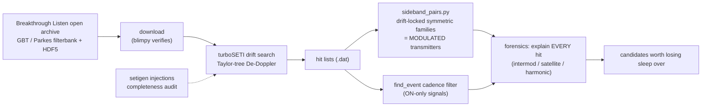

# setiTuna 🛸 — a backyard SETI rig on Breakthrough Listen open data

Hunt for technosignatures in public data from the world's biggest telescopes —
no dish required. Validated by detecting **Voyager 1** (carrier + both telemetry
sidebands, SNR 245, drift −0.38 Hz/s) in Green Bank open data, then re-finding
it **by structure alone** with our sideband-pair search.

## What's here
- `star_sweep.py` — **point it at a list of nearby stars and walk away.** For
  each target it queries the BL archive, pulls the data, runs turboSETI's drift
  search, and applies RFI forensics (a real signal drifts at *varied* rates;
  interference sits at one). Writes a verdict table. Swept 6 neighbors incl.
  Barnard's Star and Tau Ceti — all RFI, zero candidates (`SWEEP_RESULTS.md`).
- `sideband_pairs.py` — the search nobody else runs: post-process turboSETI hit
  lists for **symmetric sideband families sharing a common drift** — the
  signature of a *modulated transmitter* (data!), not just a dead carrier.
  Validated: given three anonymous hits, it autonomously flagged Voyager as
  `TRIPLET ... carrier + data sidebands: a TRANSMITTER`.
- `cyclo.py` — **the frontier: a detector for signals turboSETI is blind to.**
  A drift search only finds loud narrowband *carriers* — radio like 1950s Earth.
  Anyone slightly ahead of us transmits *spread-spectrum* that looks like pure
  noise in the spectrum. `cyclo.py` catches it via the cyclic autocorrelation:
  it detected a spread signal at **−10 dB SNR (invisible to any spectrum search)
  with zero false alarms** (`CYCLO_RESULT.md`). `python cyclo.py selftest`.
- `comb.py` — **frequency-comb** detector: fires on uniform Hz-spaced tones (an
  engineered reference nature doesn't fake), silent on the same count of randomly
  spaced tones (`COMB_RESULT.md`). `entropy.py` — **compressibility** detector:
  a carrier is boring (compresses to nothing), noise is structureless, a *message*
  is the middle; scores it by spectral flatness (`ENTROPY_RESULT.md`).
- `agent.py` — **the ensemble**: runs the whole novel-detector panel (cyclo +
  comb + entropy) on a capture and reports which fire. `python agent.py selftest`
  regression-gates all three at once. New detectors drop in and are picked up
  automatically — how the panel grows toward "try every way of being artificial."
- `NOVEL_DETECTORS.md` / `IDEAS.md` — why past SETI probably looked for the
  wrong thing, and the roadmap of detectors nobody runs (cyclostationarity ✅,
  frequency combs ✅, entropy/compressibility ✅, zero-drift beacons,
  polarization, pulsed-timing).

## Quickstart — hunt for aliens yourself
```bash
pip install -r requirements.txt          # numpy, scipy, turbo_seti, blimpy
python agent.py selftest                 # prove all 3 novel detectors work (no data needed)
python star_sweep.py GJ699 GJ411 GJ71    # sweep real stars from the BL open archive
python agent.py capture.cs16 2048000     # run the novel-detector panel on your own IQ
```
`star_sweep.py` needs `curl` on PATH (ships with Windows 10+/macOS/Linux). The
BL archive is free and public: <http://seti.berkeley.edu/opendata>. Each target
pulls ~0.2–0.3 GB into `data/` (gitignored) and deletes it after the hunt.

## Architecture


## Honesty rails
Every hit gets *explained*, not thresholded away. Completeness measured by
synthetic injection. Negative results published. The one confirmed
interstellar-distance technosignature (Voyager 1) is the standing calibration.

Data files are not in the repo (`data/` is gitignored) — fetch from the
[BL open archive](http://seti.berkeley.edu/opendata).
