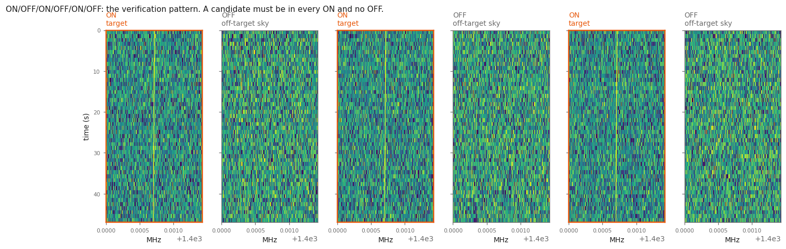
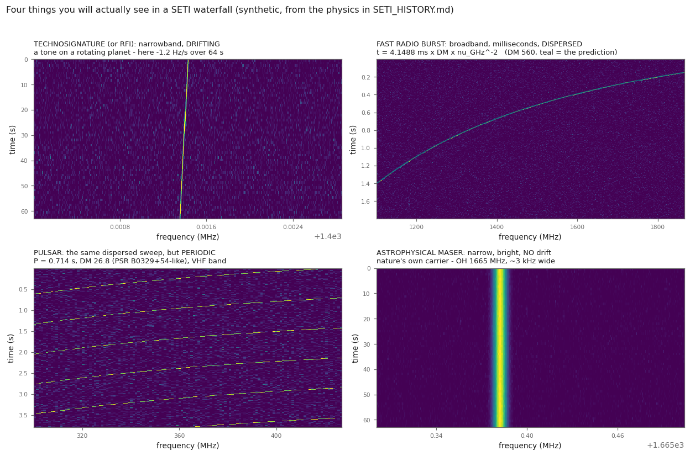
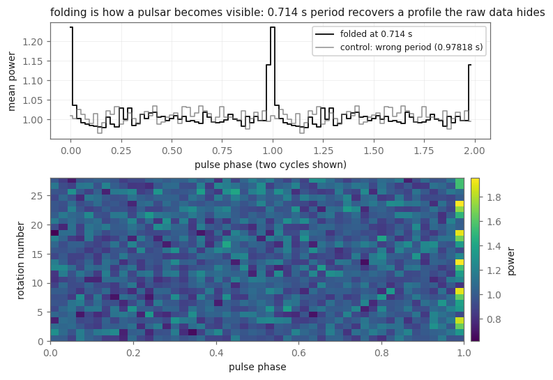
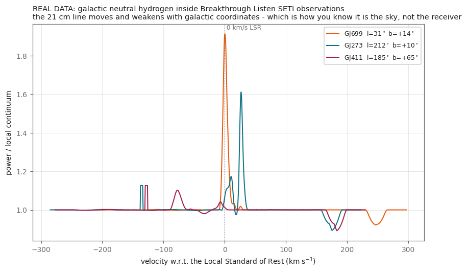
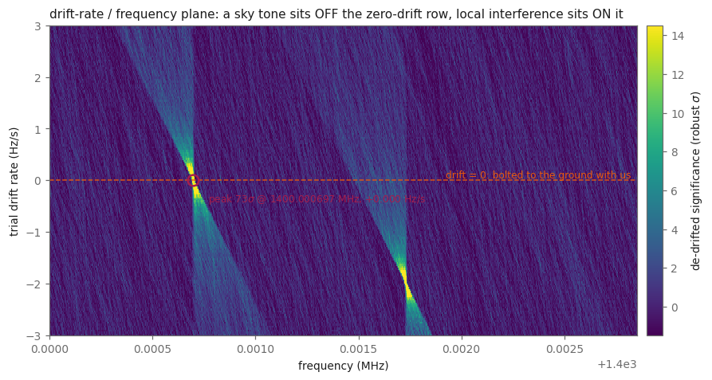

# What people found when they went looking for aliens

Nobody has found aliens. Everybody who looked properly found *something* —
and the something turned out to be pulsars, magnetars, hydrogen, masers,
microwave ovens, and the inside of their own receiver.

This document is the field guide to that. Part 1 is the history: who looked, with
what, and how each candidate died. Part 2 is the part that is actually useful —
**the catalogue of natural phenomena a technosignature search finds instead**, and
what each one *looks like* in a waterfall, so you can recognise it in your own
data. Part 3 is the honest answer to "what can I detect myself?", including the
truthful answer about black holes.

Every claim has a citation. Where something is disputed, it says so. Where we
could not verify something, it says that too.

---

## Part 1 — the people who looked

### Before anyone looked: two men and some scrap metal

**Karl Jansky**, at Bell Telephone Laboratories in Holmdel, New Jersey, was
investigating static on transatlantic shortwave radiotelephone circuits when in
**1931–32** he found a hiss that rose and fell with sidereal rather than solar
time. By 1935 he had established that his "star noise" came from the Milky Way,
brightest toward the galactic centre. The unit of radio flux density is named after
him: 1 Jy ≡ 10⁻²⁶ W m⁻² Hz⁻¹.

**Grote Reber** read Jansky's papers, and — an amateur, working alone — built a
**9.1 metre parabolic dish in his back yard in Wheaton, Illinois, in 1937**. By
1939 he had confirmed the galactic emission at **160 MHz**, and he went on to make
the first systematic radio map of the sky. For most of a decade he was essentially
the only radio astronomer on Earth.

> **Radio astronomy was founded by a man in a suburban back yard with home-built
> gear.** Keep that in mind for Part 3.

### Project Ozma (1960) — the first one

Frank Drake pointed the 85-foot Howard E. Tatel telescope at Green Bank at two
sun-like neighbours, **Tau Ceti** and **Epsilon Eridani**, starting **8 April
1960** and accumulating about **150 hours** by July. He listened at the 21 cm
hydrogen line with a **single 100 Hz channel scanned across a 400 kHz band** —
because if anyone were transmitting deliberately, the most universally obvious
frequency in the galaxy is the one hydrogen itself broadcasts. That 100 Hz channel
is the more telling number than the bandwidth: **SETI has been a narrowband search
from its first hour.**

Almost immediately — accounts put it on or near that first day, on the slew to
Epsilon Eridani — a strong pulsed signal drove the chart recorder off scale. It was
terrestrial. ⚠️ **Sources genuinely conflict on what it was:** some say a
high-flying aircraft, others that the receiver had inadvertently eavesdropped on a
classified military experiment. These are probably the same event described at
different levels of declassification (an aircraft carrying a classified emitter).
Drake's memoir *Is Anyone Out There?* is the primary account; we could not settle
it, and it is fair to present both readings.

Either way the founding lesson stands: **your first candidate is your equipment or
your neighbours.** *(A sequel, Ozma II, ran 1972–76 on Green Bank's 300-foot dish
over 670 nearby stars. Also nothing.)*

*(setiTuna re-observed Epsilon Eridani with modern Breakthrough Listen data
64 years later — `EPSILON_ERIDANI_RESULT.md`. Nothing.)*

### The Wow! signal (15 August 1977) — the one that is still open

Jerry R. Ehman, working through printouts from the Ohio State "Big Ear"
telescope, found a 72-second-long narrowband burst and wrote "Wow!" in the margin.
The numbers, from Ehman's own account:

| | |
|---|---|
| time | 15 August 1977, 22:16 EST (03:16 UTC 16 Aug) |
| frequency | **1420.4556 ± 0.005 MHz** |
| receiver | 50 channels, each **10 kHz** wide |
| duration | **72 s** = six 12-second samples |
| peak | **~30σ** |
| flux | **54 Jy or 212 Jy** — Ehman computed both by different methods and the disagreement was never resolved |
| bandwidth | **unresolved: < 10 kHz** (one channel) |
| position (J2000) | RA 19h25m31s **or** 19h28m22s ± 10s, Dec −26°57′ ± 20′ — Sagittarius |

**`6EQUJ5` decoded.** Each character is one 12-second sample encoding
signal-to-noise in σ above baseline: blank = 0–0.999, digits 1–9 = 1.0–9.999, and
letters A–Z = 10–35.999. So the sequence reads
**6σ → 14σ → 26σ → 30σ → 19σ → 5σ** — a clean rise and fall, exactly what a fixed
point source does while drifting through a stationary beam. **That is why 72
seconds is the interesting number: it is the beam transit time.** The signal
behaved like something in the sky, not something on the ground.

**The awkward detail.** Big Ear had **two feed horns** about 4.7 feet apart along
an east–west line, so a source swept both beams about a minute apart. The Wow!
signal appeared in **only one horn** — which is why the right ascension has two
possible values, and which is genuinely hard to reconcile with a steady celestial
source.

**It never repeated, and the non-detections are properly quantified:**
- **Gray & Marvel 2001** (*ApJ* 546, 1171) searched the error boxes with the **VLA**
  at **>100× the original sensitivity** and found **no narrowband point source
  across 1.5 MHz down to ~20 mJy** — ruling out a continuous source unless it had
  faded by more than a factor of ~100. They explicitly note their 5–22 minutes per
  field *"does not significantly constrain the possibility of intermittent
  sources."*
- **Gray & Ellingsen 2002** (*ApJ* 578, 967) watched the locale for **~14 hours**
  with the **Hobart 26 m** over multiple days across 2.5 MHz, reaching a flux limit
  of **~18 Jy**. Nothing repeating more often than every 14 hours.

**The comet hypothesis — proposed, then rejected.** Antonio Paris proposed
(2015/2017, *J. Wash. Acad. Sci.*) that hydrogen outgassed by comets
**266P/Christensen** and **P/2008 Y2 (Gibbs)** passed through the beam. It has been
rejected on three counts: those comets were **not in the beam at the right time**;
cometary hydrogen is **orders of magnitude too faint** for a 30σ, >50 Jy signal;
and a slow extended object should have shown up in **both** horns and on later
transits. It is a good cautionary tale about a plausible-sounding natural
explanation that fails on geometry and energetics.

**⭐ The live hypothesis, and it is directly relevant to this repo.**
**Méndez, Ortiz Ceballos & Zuluaga 2024** (arXiv:2408.08513) mined **archival
Arecibo drift scans from February–May 2020 at 1420 MHz**, deliberately mimicking
Big Ear's method with better sensitivity. They found **at least four narrowband
signals near the HI line with Δν ≤ 10 kHz**, persisting through drift scans up to
ten minutes, at **413–820 mJy** — about two orders of magnitude fainter than Wow!.
They identify these as **cold interstellar HI clouds**, and propose that Wow! was a
sudden brightening of such a cloud — **a maser or superradiance flare in the 21 cm
line, triggered by a transient like a magnetar or soft-gamma-repeater flare
behind it**, which can raise brightness by enormous factors on timescales of
seconds to minutes. A **2025 follow-up** (arXiv:2508.10657) refines the event to
**> 250 Jy at 1420.726 ± 0.005 MHz**, implying a substantially higher radial
velocity than previously assumed and supporting a galactic cold-hydrogen origin.

Two calculations make this hypothesis hard to dismiss the way the comet one was:

```
Ehman's   1420.4556 MHz  →  +49.8 kHz from rest  →  |v| ≈ 10.5 km/s
Méndez's  1420.726  MHz  →  +320.2 kHz          →  |v| ≈ 67.6 km/s
a cold HI cloud with 1 km/s dispersion has a line width of ~4.7 kHz
Big Ear's channel was                                     10 kHz
```

**A cold hydrogen cloud's line is exactly the right width to be unresolved in Big
Ear's channel.** The authors explicitly frame their result as *"a new source of
false positives in technosignature searches."* ⚠️ It should be said plainly that a
21 cm maser/superradiance flare is itself exotic and not independently confirmed.

The honest status: **unexplained, unrepeated, and not evidence of anything** — but
with, for the first time, a mechanism that explains *why 1420 MHz*.

### SERENDIP and SETI@home (1979 → 2020) — the piggyback era

Berkeley's **SERENDIP** programme (1979 onward, through several generations at
Arecibo) took the cheapest possible approach: ride along on somebody else's
observation, analyse whatever the telescope happens to be pointed at. You do not
choose your targets, but you get enormous sky coverage for free.

**SETI@home** (launched 17 May 1999, Berkeley; David Anderson and Dan Werthimer)
turned the SERENDIP data stream into the most famous distributed-computing project
ever built — millions of volunteers running a screensaver that searched for
narrowband, drifting signals. It stopped distributing new work on 31 March 2020.
It found no aliens, and it changed public computing forever.

Its one publicised candidate, **SHGb02+14a** (found in 2003 data by two volunteers,
publicised by *New Scientist* in 2004), was seen three times, near 1420 MHz,
drifting fast, in a direction with **no stars within a thousand light-years** — and
never confirmed. SETI@home itself disowned the media framing. It is best understood
as what the tail of a search with billions of trials looks like.

**And the project did publish its final answer, recently and properly.** Anderson,
Korpela, Werthimer, Cobb & Allen (2025, *AJ* 170) report the analysis of **14 years
of Arecibo data (2006–2020)**: roughly **12 billion raw detections** condensed to
**20 million "multiplets"**, of which about a thousand were examined by hand and
**~200 selected for follow-up** (now being reobserved with FAST). Their conclusion,
verbatim: *"To date, no repeatable detections of interstellar technosignatures have
been made."* The pipeline was validated by injecting artificial **"candidate
birdies"** — the same completeness discipline this repo uses with setigen.

### NASA's Microwave Observing Project → Project Phoenix (1992–2004)

NASA's High Resolution Microwave Survey began observing on **12 October 1992**
(the 500th anniversary of Columbus's landfall, chosen deliberately) with
**$11.5 million** for a planned ten-year run, and was **cancelled one year in** by
an amendment Senator **Richard H. Bryan** of Nevada introduced on 22 September
1993, with the remark that *"this will hopefully be the end of Martian hunting
season at the taxpayer's expense."*

The SETI Institute resurrected the targeted half privately as **Project Phoenix**
(**February 1995 – March 2004**): **~800 Sun-like stars within about 200 light
years**, **1000–3000 MHz**, at resolutions **as fine as 1 Hz**, using Parkes, then
the NRAO 140-foot, then Arecibo. ⚠️ *The Arecibo phase's pseudo-interferometric
setup — with Jodrell Bank as a simultaneous confirmation antenna, an excellent idea
that anticipates the modern cadence test — is widely reported but we could not
verify it from a primary source.* Project leader Peter Backus, on the negative
result: *"we live in a quiet neighborhood."*

The lesson here is structural, not scientific: **SETI has been privately funded
ever since**, which is exactly why the modern data is *public*.

### Breakthrough Listen (2015 → )

Announced 20 July 2015 — $100 million over ten years from Yuri Milner, with
Stephen Hawking at the podium — Breakthrough Listen is by far the largest search
ever attempted: the one million nearest stars, the plane and centre of the Milky
Way, and 100 nearby galaxies, using the **Green Bank Telescope**, **Parkes**, and
(for optical pulses) the Automated Planet Finder.

The part that matters for this repo: **the data is open.** Petabytes of raw and
reduced spectrograms from the world's best single dishes, free to download, which
is why a hobbyist with a laptop can do real SETI at all (Lebofsky et al. 2019;
Price et al. 2020). Everything setiTuna does runs on it.

### The Allen Telescope Array

Hat Creek, California: **42 six-metre dishes of a planned 350**, covering
**0.5–11.2 GHz**, built with funding from the Paul G. Allen Family Foundation, and
the first radio telescope designed from scratch with SETI as a primary purpose.
ATA-42 became operational in October 2007, went into **hibernation in April 2011**
when operating funds ran out, and **resumed operations on 5 December 2011** after
several hundred thousand dollars in private donations. From 2019 it has been
refurbished with wideband "Antonio" feeds and new signal processing.

As of 2016 the ATA had followed up and classified **over 200 million signals**.
**None** had all the characteristics expected of a transmitter. Its design lesson
is that **many small dishes beat one big one** for a search that needs to look at
many places at once — and its funding history is why the field's data is public.

### Optical SETI, briefly

Radio is not the only channel, and the alternative is older than most people think:
**Schwartz & Townes (1961, *Nature*)** proposed interstellar communication by
optical maser — i.e. laser — the year after Ozma. The 1971 Cyclops study dismissed
it as impractical; Townes revived the argument in 1983.

What exists now searches for **pulses**, not carriers, because a nanosecond laser
pulse can briefly outshine its own star:

- **Paul Horowitz's** Harvard/Princeton programme piggybacked a laser detector on a
  155 cm telescope (1998–99, ~2500 stars, nothing), then ran matched systems at two
  observatories for simultaneous cross-verification — the optical equivalent of the
  cadence test.
- **NIROSETI** (2015, Lick; Shelley Wright) looks in the **near infrared,
  950–1650 nm**, for **nanosecond** pulses using fast low-noise avalanche
  photodiodes. The near-IR matters because dust extinction is lower there.
- **LaserSETI** (SETI Institute, Eliot Gillum) takes the wide-field approach: pairs
  of CCD cameras behind **transmission gratings mounted at 90° to each other**,
  reading out **over 1000 frames per second**, so a millisecond non-repeating flash
  is caught *and* spectrally distinguished from a star. Stations are operating in
  California, Hawaii, Arizona and Puerto Rico. It also catches meteors, fireballs
  and re-entering debris — the same "know your natural background" problem as radio.
- **PANOSETI** (Lick, 2020) is the all-sky nanosecond-pulse version.

Nothing in this repo touches optical, but the *methodology* transfers exactly:
simultaneous independent stations, spectral discrimination, and knowing what nature
does.

### The candidates, and how each one died

| candidate | year | what it was | how it ended |
|---|---|---|---|
| Ozma's first signal | 1960 | strong narrowband near Epsilon Eridani | terrestrial interference (aircraft/military radar) |
| **Wow!** | 1977 | 72 s, 1420.4556 MHz, 30σ, one horn | **never repeated; still open**; comet and magnetar-flare hypotheses both contested |
| EQ Pegasi | 1998 | "detection" announced online | **hoax** |
| SHGb02+14a | 2004 | SETI@home candidate, 3 sightings | never confirmed; consistent with noise |
| HD 164595 | 2015/16 | 11 GHz burst, RATAN-600 | terrestrial/satellite interference |
| Ross 128 "Weird!" | 2017 | odd broadband pulses, Arecibo | **geostationary satellites** |
| **BLC-1** | 2019/2020 | **982.002571 MHz, drift 0.038 Hz/s**, toward Proxima Centauri, Parkes | **local interference** — an "electronically-drifting intermodulation product of local, time-varying interferers aligned with the observing cadence" (Sheikh et al. 2021) |
| Ross 128 "Weird!" | 2017 | broadband quasi-periodic pulses with dispersion-like structure, Arecibo C band | **geostationary satellites** — Breakthrough Listen observed simultaneously at GBT and saw nothing (Enriquez et al. 2017) |

**BLC-1 is the modern textbook case** and the reason `cookbook.py cadence` exists.
Look at its drift rate: **0.038 Hz/s** sits comfortably inside the window a beacon
on a rotating planet would occupy. It looked *right*. It was the best candidate in
decades.

What killed it was not that the signal looked wrong. It was two pieces of
unglamorous bookkeeping:

1. **The signal's appearances coincidentally aligned with the ON/OFF cadence** — and
   once that was tested properly rather than assumed, the alignment broke.
2. **A systematic search of the surrounding spectrum found its siblings**: dozens of
   interference features with the same morphology at frequencies **harmonically
   related to common clock oscillators**, including about three dozen look-alikes
   the pipeline had already discarded as obviously terrestrial.

> **Cadence-alignment checking and harmonic-family searching are what resolved
> BLC-1.** Both are implemented here — `recipe_api.cadence_verify()` and
> `recipes/comb_uniformity.py` respectively — and neither is optional.



### The perytons — the best story in radio astronomy

**Stage one: the alarm.** In 2011, Burke-Spolaor and colleagues reported 16 bursts
recorded in a *sidelobe* of the Parkes telescope with "a frequency sweep with a
shape and magnitude resembling the Lorimer Burst" — but of *"clearly terrestrial
origin, with properties unlike any known sources of terrestrial broad-band radio
emission."* They named them **perytons**, after the mythological winged deer that
casts the shadow of a man. **This cast direct doubt on whether fast radio bursts
were real at all**, and for four years the field genuinely did not know.

**Stage two: the solution.** In 2015 Emily Petroff and colleagues installed an RFI
monitor and caught them in the act (*MNRAS* 451, 3933). The perytons were the
site's **microwave ovens** — specifically, ovens whose door was opened *before* the
timer finished, so the magnetron shut down mid-cycle and radiated a swept 1.4 GHz
chirp on the way down. Two ovens on site were over 27 years old. The smoking-gun
detections happened on the Monday, Thursday and Friday of one week in January 2015.
**And the events clustered at lunchtime, on weekdays.**

| peryton property | value |
|---|---|
| apparent DM range | **189.8 – 413.8 pc cm⁻³** (i.e. plausibly extragalactic) |
| duration | ~250 ms across the band |
| band | 1.4 GHz (1382 MHz centre, 400 MHz wide) |
| **the giveaway** | **coincident out-of-band emission at 2.3–2.5 GHz** |
| total catalogued | 46 perytons across surveys |

Why this is more than a funny anecdote: identifying perytons as a separate class is
**what let the community assert FRBs are real.** Petroff et al. explicitly showed
the on-site ovens could not have produced FRB 010724 and enumerated the
differences. FRBs went from "possibly all perytons" to *"excellent candidates for
genuine extragalactic transients"* in one paper. **Finding out what your
interference actually is can be a scientific result in itself.**

**⭐ Three transferable lessons, each directly supported by the paper:**

1. **Check out of band.** The discovery hinged on 2.3–2.5 GHz emission nobody had
   thought to look at.
2. **Check the exact functional form, not just "it sweeps."** Perytons chirp but do
   **not** obey the quadratic cold-plasma law precisely, and they **lack the
   frequency-dependent scattering tails** real FRBs show. This is why
   `recipes/dispersion_sweep.py` reports a fitted **DM** rather than a yes/no.
3. **Check the time-of-day and day-of-week distribution.** Human behaviour has a
   schedule. The cosmos does not.

*(The general principle shows up in our own data too: `natural_signals.py` measures
the Green Bank spectrometer's coarse-channel edges — a dip every 2.930 MHz, 270–327
of them per file — and labels them instrument, not sky.)*

---

## Part 2 — the natural phenomena SETI finds instead

This is the useful part. Below, each phenomenon gets the physics, the discovery
story where there is one, and — critically — **what it looks like in a
waterfall**, so you can recognise it.

Here is the shape vocabulary, generated from the formulae quoted in this section
(`python waterfall.py figures`):



Two numbers do most of the work in what follows:

- **The 21 cm line rest frequency: 1420.405751768 MHz.** Doppler shift converts
  frequency offset to velocity: `v = -c · Δf / f₀`, so at 1420 MHz, 1 km/s is
  4.74 kHz.
- **The dispersion delay:** a broadband pulse crossing ionised plasma arrives
  later at lower frequency,

  > **t = 4.148808 × 10³ · DM · ν_MHz⁻² seconds**, i.e. **4.148808 ms · DM · ν_GHz⁻²**

  where DM (the dispersion measure, pc cm⁻³) is the integrated free-electron
  column to the source. This single formula is what separates an FRB from
  everything else in the sky, and it is implemented in
  `seti_io.Spectrogram.dedisperse()`.

### ⭐ Which of these is actually the confusion class? Do the arithmetic first

This is the most useful thing in the document and almost nobody states it, so it
goes first. Breakthrough Listen's fine product has **~3 Hz** channels and **18 s**
samples, and Enriquez et al. (2017) searched drift rates of **±2 Hz/s** — chosen
because, quoting the paper, *"the frequency drift induced by Earth's rotation alone
is up to 0.16 Hz s⁻¹ at 1.4 GHz."*

Now compute what nature does in the same plane. A dispersed burst sweeps at
dν/dt = −ν³/(2·4.1488×10³·DM):

| phenomenon | drift rate | ratio to the SETI window |
|---|---|---|
| **a beacon on a rotating planet** (Earth analogue, 1.4 GHz) | **0.16 Hz/s** | **1×** |
| Jupiter S-burst @ 20 MHz | −2 × 10⁷ Hz/s | 10⁷ |
| solar Type III @ 150 MHz | −1 × 10⁸ Hz/s | 10⁸ |
| FRB, DM 560 @ 1.4 GHz | **−5.9 × 10⁸ Hz/s** | **10⁹** |

> **Nature's famous drifting signals drift 10⁷–10⁹ times faster than a beacon on a
> rotating planet.** In a 3 Hz channel an FRB dwells about **five nanoseconds** — it
> is not a sloped line, it is a single-time-sample broadband stripe.
>
> **So pulsars and FRBs are *not* the confusion class for narrowband SETI**, despite
> being the famous radio transients. The genuine confusion class is everything with
> **near-zero drift and small bandwidth**: astrophysical **masers**, cold **HI
> clouds**, and above all **terrestrial RFI**.

The catalogue below is ordered with that in mind: the transients are here because
they are magnificent and because you will meet them, but the sections that matter
for a false alarm are the masers, hydrogen, and the microwave oven.

### Pulsars — the original "little green men"

In late 1967 Jocelyn Bell (now Bell Burnell), a graduate student at Cambridge
working on interplanetary scintillation, found a source emitting a pulse every
**1.337 seconds** with clock-like regularity. The regularity was the problem:
nothing known in astronomy did that. The signal was labelled **LGM-1** — "Little
Green Men 1" — half in joke, and taken seriously enough that the team worked hard
to rule out intelligence before publishing (Hewish, Bell, Pilkington, Scott &
Collins 1968, *Nature* 217, 709). Finding a *second* one, elsewhere in the sky
with a different period, is what settled it: two independent civilizations both
broadcasting metronomes was less likely than a new kind of star.

That source is now **PSR B1919+21**, a rotating neutron star. Antony Hewish and
Martin Ryle received the 1974 Nobel Prize; Bell Burnell did not, which remains
one of the most-discussed omissions in the history of the prize.

**The signature.** In a waterfall: a **vertical stripe of broadband pulses,
repeating on a precise period** — the population runs from **1.4 ms to 8.5 s**,
with duty cycles of a few percent — each pulse **swept in frequency by dispersion**.
For the classic bright test source PSR B0329+54 (P = 0.7145 s,
DM = 26.7641 pc cm⁻³) the sweep is **16.4 ms across 1.3–1.5 GHz**: a small tilt you
must nonetheless remove before folding. At VHF it becomes hundreds of milliseconds
and unmistakable (see the atlas figure above, which uses a 300–427 MHz band for
exactly that reason). Emission is usually strongly linearly polarised, with the
characteristic S-shaped position-angle sweep across the pulse.

**The visually dominant feature is not the pulses — it is the scintillation.**
Diffractive interstellar scintillation breaks the emission into bright patches
("scintles") in the time–frequency plane, and it can change the flux by more than an
order of magnitude. Measured for **B0329+54 at 1540 MHz: a diffractive timescale of
12–30 minutes and a decorrelation bandwidth of 5–34 MHz.** Note the discriminator
that matters here: **scintles are MHz-wide — thousands of 3 Hz SETI channels — not
Hz-wide.** Scintillation makes a broadband source look patchy; it does not make it
narrowband.

Two clarifications worth making because they are commonly garbled:

- **Drifting sub-pulses** appear in a *pulse stack* (pulse number versus rotational
  phase), **not** in the frequency–time waterfall. Different plot, different axes.
- **B0329+54 is a poor example of *nulling*** — its measured nulling probability is
  very low (upper limits of 0.13% and 1.68% at 13 and 3 cm). It is, however, a
  well-known **mode changer**.

**Why a SETI pipeline mostly misses them, and shouldn't:** they are *broadband*
and *time-domain*. A narrowband drift search integrates them into the noise. To
see one you fold:



*Single pulses are usually invisible. Folding the light curve at the right period
adds them coherently; folding at the wrong period does not. That difference is
the detection.* (`python waterfall.py fold <file> --period 0.7145 --dm 26.8`)

**Millisecond pulsars** (the first was PSR B1937+21 at **1.5578 ms**, Backer et al.
1982) are old neutron stars spun up by accretion; the best of them keep time to
comparable precision to atomic clocks over years, which is why they are used to
hunt gravitational waves. There is a pedagogical point in that number:
**1.5578 ms is faster than most spectrometer dump times, so a millisecond pulsar
does not *look* like anything in a waterfall at all.** It is a statistical object,
recovered only by coherent dedispersion and folding — a useful reminder that "what
does it look like?" presupposes a resolution.

**Pulsar glitches** are the exception that proves the rule: occasionally — the
Vela pulsar is the classic, glitching every few years since the first observed
event in 1969 — a pulsar's rotation rate jumps *up* abruptly, then relaxes. It is
thought to be the superfluid interior transferring angular momentum to the crust.
If you are hunting engineered timing, glitches are the natural background you have
to know about. (Conversely: NOVEL_DETECTORS.md #7 argues that a pulsar with
*impossibly low* jitter would be the interesting thing to look for.)

**RRATs** — Rotating Radio Transients (McLaughlin et al. 2006, *Nature* 439, 817)
— are pulsars that emit only sporadic single pulses, minutes to hours apart, with
underlying periods of 0.7–7 s. They look like a random scatter of dispersed bursts
until you find the underlying period, and population estimates suggest **there may
be more RRATs in the galaxy than ordinary radio pulsars.**

**How they were found is the methodological lesson:** by **reprocessing the Parkes
Multibeam Pulsar Survey with a single-pulse search instead of a periodicity
search.** Eleven neutron stars had been sitting in existing data, invisible to the
question everyone was asking. That is precisely the argument
[NOVEL_DETECTORS.md](NOVEL_DETECTORS.md) makes about SETI, and precisely what the
recipe cookbook is for: **the archive is not exhausted, the question list is.**

*(Note also that a single RRAT pulse is indistinguishable from an FRB in a
waterfall except by its **DM** — galactic, tens to a few hundred — and by eventual
coherent repetition. RRATs, FRBs and perytons all came out of the same detection
pipeline.)*

### Fast radio bursts — milliseconds, and the sad trombone

**Lorimer et al. 2007** (*Science* 318, 777) found a single 5 ms burst in archival
Parkes data from 2001 — FRB 010724, the "Lorimer burst" — with a dispersion
measure far too large for anything inside the Milky Way. For years it was one
event, contaminated by the peryton confusion (above), and the field argued about
whether it was real.

It was. There are now thousands. The milestones:

- **FRB 121102** — the first *repeater* (Spitler et al. 2016, *Nature* 531, 202),
  which killed all one-shot cataclysmic models by itself. Breakthrough Listen
  recorded **21 bursts from it in a single hour at 4–8 GHz with the Green Bank
  Telescope** (Gajjar et al. 2018, *ApJ* 863, 2), DM ≈ 560 pc cm⁻³ — and that data
  is **public**, which makes it the best available real example of a dispersion
  sweep for anyone learning to recognise one.
- **FRB 180916.J0158+65** — repeats with a **16.35-day periodicity** in its
  activity window (CHIME/FRB Collaboration 2020, *Nature* 582, 351), implying an
  orbit or a precession, not a one-off explosion.
- **SGR 1935+2154** — in April 2020 a *known galactic magnetar* emitted an
  FRB-like radio burst, detected by CHIME and STARE2 (CHIME/FRB Collaboration
  2020 and Bochenek et al. 2020, both *Nature* 587). This is the closest thing to
  a smoking gun: **at least some FRBs are magnetars.**
- **CHIME/FRB Catalog 1** (2021, *ApJS* 257, 59) published **536 bursts**
  (including 62 bursts from 18 repeating sources) with their dynamic spectra, and
  measured the population's cumulative fluence index at **α = −1.40 ± 0.11** and a
  sky rate of **~525 per sky per day above 5 Jy ms at 600 MHz**. **Catalog 2**
  (arXiv:2601.09399) now lists **4539 bursts from 3641 sources**, 981 of them from
  83 repeaters. This is the friendliest public dataset for seeing FRB morphology.

**The signature, quantitatively.**

- **Duration:** Gajjar et al. measured an **average burst width of 0.64 ± 0.46 ms**
  for FRB 121102 at 4–8 GHz.
- **Dispersion:** DMs run from ~100 to a few thousand pc cm⁻³. FRB 121102 sits at
  **DM = 560.57 ± 0.07** (Hessels et al. 2019 — cite them for the value; Gajjar et
  al. only searched 500–600 in steps of 0.1). At CHIME's 400–800 MHz that DM
  produces a sweep of about **11 seconds** across the band — an enormous diagonal
  streak. At 4–8 GHz it is **109 ms**.
- **Band-limited, not truly broadband.** Gajjar et al., verbatim: *"Broad features
  occur in ~1 GHz wide subbands that typically differ in peak frequency between
  bursts within the band."* This matters: an FRB does not fill your whole waterfall.
- **Fine structure from scintillation:** *"finer-scale structures (~10–50 MHz)
  within these bursts are consistent with that expected from Galactic diffractive
  interstellar scintillation."*
- **The "sad trombone."** Hessels et al. 2019: at 1.1–1.7 GHz, the **~0.5–1 ms
  sub-bursts have bandwidths of 100–400 MHz and drift downward at roughly
  200 MHz per millisecond.** This is *sub-burst* drift — intrinsic or near-source,
  and far steeper than the envelope's dispersion sweep. Higher observing frequencies
  show larger bandwidths and larger drift rates.
- **Polarisation:** for FRB 121102, **nearly 100% linear and zero circular**, with a
  rotation measure of **9.359 × 10⁴ rad m⁻²** and a constant position angle across
  bursts — an extreme magneto-ionic environment.
- Repeaters tend to be **narrower-band and longer-duration** than one-offs, and
  scattering by turbulent plasma smears the pulse asymmetrically, worse at low
  frequency (roughly as ν⁻⁴).

**How to tell it from a technosignature:** dispersion is nature's fingerprint. A
transmitter has no reason to smear its signal by exactly `4.1488 ms · DM · ν⁻²`.
Conversely — NOVEL_DETECTORS.md #8 — a wideband impulse with the *wrong*
dispersion, or repeating on a mathematically loud schedule, would be extremely
interesting. `recipes/dispersion_sweep.py` measures DM so you can ask.

### Magnetars

Neutron stars with magnetic fields of 10¹⁴–10¹⁵ gauss, which is strong enough
that the field itself powers the emission rather than rotation. They produce
X-ray/gamma bursts, occasional giant flares, and — as SGR 1935+2154 showed —
FRB-like radio bursts. In a radio waterfall they appear as **rare, bright,
dispersed single bursts** with no stable period, sometimes accompanied by a
transient pulsar-like phase after an outburst.

### Masers — nature's narrowband carriers, and the real problem for SETI

This is the class every technosignature hunter has to understand, because
**masers are the one natural thing that makes genuinely narrowband, genuinely
bright radio lines.**

Molecular gas in a specific temperature/density regime can be pumped into a
population inversion and amplify its own line emission — a naturally occurring
maser. Rest frequencies below are from the **CDMS** and **JPL** spectral line
catalogues (catalogue uncertainty in brackets):

| species | frequency (MHz) | Hz per km/s | where |
|---|---|---|---|
| **OH** F=1→2 | **1612.2309** | 5378 | evolved / OH-IR stars — the classic double-peaked shell |
| **OH** F=1→1 | **1665.4018** | 5555 | star-forming regions; usually the *brightest* OH maser |
| **OH** F=2→2 | **1667.3590** | 5562 | star-forming regions |
| **OH** F=2→1 | **1720.5299** | 5739 | **shock maser** — supernova remnants hitting molecular clouds |
| **H₂O** 6₁₆–5₂₃ | **22235.0798** (±0.0001) | 74 170 | star formation, evolved stars, AGN megamasers |
| **CH₃OH** 5₁–6₀ A⁺ | **6668.519** (class II) | 22 250 | massive star formation, radiatively pumped |
| **CH₃OH** 2₀–3₋₁ E | **12178.597** (class II) | 40 630 | as above |
| **CH₃OH** 7₀–6₁ A⁺ | **44069.410** (class I) | 147 000 | shocked outflow interfaces, collisionally pumped |
| **SiO** v=1, J=1–0 | **43122.0747** (±0.002) | 143 800 | inner circumstellar envelopes of AGB/Mira stars |

The OH quartet arises from Λ-doubling plus hyperfine coupling, and in local
thermodynamic equilibrium the four lines should have relative intensities
**1 : 5 : 9 : 1** (1612 : 1665 : 1667 : 1720). **Any departure from that ratio is
the fingerprint of inversion** — a clean, checkable diagnostic that a line is a
maser rather than thermal gas.

⚠️ **A trap worth knowing:** the 6.7 GHz methanol maser frequency differs between
the CDMS global fit (6668.5640 MHz) and the value maser astronomers actually use
(**6668.519 MHz**, adopted by the Methanol Multibeam survey). That is **44.8 kHz
≈ 2.0 km/s** — larger than either stated uncertainty and astrophysically
significant. Always say which rest frequency you used. The laboratory reference is
Müller, Menten & Mäder 2004, *A&A* 428, 1019.

**The signature.** In a waterfall: a **bright, narrow, essentially non-drifting
line**, sitting on one of the frequencies above, resolved into **multiple velocity
components** — often variable on weeks to months, sometimes flaring by orders of
magnitude. Circular and linear polarisation are common and can be extreme (up to
66% linear in the outer OH shell of OH 26.5+0.6). The **OH/IR double peak** is
diagnostic: a radiatively pumped, spherically expanding shell shows a blue peak
(approaching cap) and a red peak (receding cap) separated by **twice the
expansion velocity, typically 20–40 km/s = 107–215 kHz at 1612 MHz** — and the
light-travel *phase lag* between the two peaks gives the shell radius and hence a
geometric distance.

**"Mysterium", 1965 — the historical precedent that matters here.** Interstellar
OH was first seen in *absorption* at 1667 MHz toward Cassiopeia A in 1963
(Weinreb, Barrett, Meeks & Henry, *Nature* 200, 829). Two years later Weaver and
colleagues found anomalously strong, **narrow, strongly polarised** 1665 MHz
*emission* that no known molecule could account for — and provisionally attributed
it to a hypothetical new species they named **"Mysterium"**, before it was
recognised as inverted OH.

> A real, narrow, strongly polarised, unattributable radio line briefly required
> inventing a new molecule. That is the honest historical frame for masers: not
> that they have ever been mistaken for aliens, but that **nature makes narrow
> polarised radio lines that look unnatural until you identify the carrier.**

**Why they matter here — and it is an irony worth stating plainly.** SETI searches
the **"water hole"**, the band between the **HI line at 1420 MHz** and the **OH
lines at 1612–1720 MHz**. The name is **Bernard M. "Barney" Oliver's**, coined
during the 1971 NASA Ames summer study that produced the **Project Cyclops** report
(1973): in an arid land, the water hole is where all life comes to meet. H and OH
are the dissociation products of H₂O, so the band is "universally obvious", and it
happens to sit near the quietest part of the spectrum seen from a planet's surface —
between galactic synchrotron falling as roughly ν⁻²·⁷ and atmospheric H₂O/O₂ rising
above ~10 GHz. *(⚠️ Sources differ on whether the upper bound is quoted as 1666 or
1720 MHz.)*

> **SETI chose 1420–1720 MHz *because* HI and OH are there — and HI and OH are
> precisely the two species that produce natural narrowband confusion.**
`recipes/hi_line_natural.py` exists to find them on purpose and
`recipe_api.NATURAL_LINES` vetoes candidates that land on them.

### How narrow can nature actually get?

This is the quantitative heart of the whole technosignature argument, so it is
worth doing with numbers rather than assertion. A SETI search works in **~3 Hz**
channels (Breakthrough Listen's fine-frequency products; setiTuna's Voyager file
is 2.79 Hz). How close does nature come?

| natural emitter | narrowest observed feature | in Hz, at its own frequency |
|---|---|---|
| galactic HI 21 cm | ~1 km/s (cold neutral medium) | ~4.7 kHz |
| OH maser feature | 0.1–0.5 km/s typical | 0.5–2.7 kHz |
| **narrowest OH maser features** | **~0.05 km/s** | **~280 Hz** |
| H₂O maser (W49N, Herschel) | ~1 km/s FWHM | ~74 kHz |
| solar Type IIIb **striae** | — | **60–100 kHz** |
| Jovian S-burst | — | tens of kHz, drifting |

The received wisdom in the SETI literature — *"the spectrally narrowest known
astrophysical sources are masers, with a minimum frequency spread of about a
kHz"* — is repeated widely without a traceable primary source (⚠️ flagged; likely
Cohen et al. 1987 or Tarter 2001), but **the catalogue arithmetic bears it out**:
nothing in the maser inventory reaches single-Hz. A 3 Hz carrier is 100–100 000×
narrower than anything nature is known to produce at those frequencies. That gap
is the entire reason narrowband SETI works at all.

**⚠️ And here is the honest counterexample, which most SETI write-ups omit.**
Earth's own **auroral kilometric radiation** — the terrestrial analogue of Jovian
DAM, produced by the electron-cyclotron maser instability in a density-depleted
auroral cavity 1–3 Earth radii up — contains **"striated" narrowband drifting
emission with an effective bandwidth of about 50 Hz** (Mutel, Menietti,
Christopher, Gurnett & Cook 2006), apparently triggered by ion solitary structures
in the acceleration region, with CMI power gain above 100 dB. That is a **~50 Hz
wide, drifting, nearly 100% circularly polarised, beamed natural tone**.

Three mitigations keep the argument alive: it is 50 Hz, not 1 Hz; it **drifts
fast**; and it sits at **50–500 kHz**, entirely below the ionospheric cutoff, so
it is physically unobservable from the ground. But the claim should be made as a
*quantitative* one with a known tail — **"nothing natural is narrower than a
kHz" is false; "nothing natural is narrower than tens of Hz, and the exceptions
drift and are unobservable from the ground" is true.**

The same electron-cyclotron maser physics also powers coherent, highly circularly
polarised, bursty emission from **flare stars and ultracool dwarfs** (e.g. CR
Draconis) — and *that* is accessible at 100 MHz–1 GHz. It is a genuine
technosignature confusion class: coherent, narrow-ish, polarised, transient,
and stellar.

### Neutral hydrogen — the line inside every SETI observation

The 21 cm line arises from the hyperfine splitting of the hydrogen ground state
(the electron and proton spins flipping from parallel to antiparallel). Any single
atom does this about once every ten million years; there is so much hydrogen in
the galaxy that it is nonetheless the brightest thing in the radio sky after the
Sun and a handful of continuum sources. Rest frequency:
**1420.405751768 MHz**.

**The signature.** A **broad emission line** — tens to hundreds of kHz wide,
i.e. tens of km/s — with **no drift**, present in *every* time sample, whose
centre frequency depends on the **direction you are pointing** because galactic
rotation gives different line-of-sight velocities in different directions. Often
multiple velocity components (one per spiral arm along the line of sight).

**And it is in our data.** Here is the 21 cm line in the same Breakthrough Listen
Green Bank files setiTuna used to hunt for technosignatures around nearby stars:



| pointing | galactic *l*, *b* | HI velocity (LSR) | peak / continuum | significance |
|---|---|---|---|---|
| GJ699 (Barnard's Star) | 31°, +14° | **+3.0 km/s** | ×1.56 | 814 σ |
| GJ273 (Luyten's Star) | 212°, +10° | **+20.6 km/s** | ×1.36 | 233 σ |
| GJ411 (Lalande 21185) | 185°, **+65°** | −77 km/s (weak, uncertain) | ×1.11 | 116 σ |

Reproduce with `python natural_signals.py data/star_*.h5 --figure figures/hi_survey.png`.
Velocities are barycentric- and LSR-corrected (astropy; solar motion from
Schönrich, Binney & Dehnen 2010).

Read the table as a physics demonstration, because that is what it is:

- **GJ699 at l = 31°, +3 km/s LSR** — looking into the inner galaxy at low
  latitude, and the local arm sits near zero velocity. Textbook.
- **GJ273 at l = 212°, +20.6 km/s** — looking outward, where galactic rotation
  gives positive line-of-sight velocities in that longitude range. Also textbook,
  and *different from GJ699*, which is the whole point.
- **GJ411 at b = +65°** — pointing up out of the galactic disc, where there is
  little gas. The line nearly vanishes (×1.11 instead of ×1.56). The −77 km/s
  centroid we measure there is weak and we do not claim it: it may be an
  intermediate-velocity cloud, or it may be the matched filter latching onto
  residual baseline structure. **Flagged as uncertain.**

**The instrument is in the same picture,** and telling them apart is the skill:
the hair-thin spikes and the broad symmetric dips in that figure are *not gas* —
they are RFI and the Green Bank spectrometer's own coarse-channel edges, which
`natural_signals.py` independently measures at **one every 2.930 MHz**.

**The general discriminator** (`natural_signals.py discriminate`, and
`sky_or_instrument` over MCP): a feature at the **same topocentric frequency** in
independent pointings on different days **cannot be the sky**, because Earth's
motion alone shifts a celestial line by up to ±30 km/s over a year. A feature
whose frequency *moves with where you point* is celestial. Same logic as the
ON/OFF cadence, applied to spectral lines.

### Recombination lines

When ionised hydrogen recombines, the electron cascades down through high
principal quantum numbers, emitting radio lines — the **Hnα series**, from the
Rydberg formula ν = R c Z²[1/n² − 1/(n+1)²] with R_H c = 3.28805129 × 10¹⁵ Hz:

| line | frequency (MHz) |
|---|---|
| H109α | 5008.923 |
| H165α | 1450.716 |
| **H166α** | **1424.734** |
| H167α | 1399.368 |

**Note where H166α lands: 1424.734 MHz, just 4.33 MHz above the hydrogen line.**
Recombination lines are *inside the water hole* and inside the passband of
essentially every 21 cm SETI observation. Helium and carbon RRLs shift the whole
series up by the reduced-mass difference, equivalent to an apparent blueshift of
**−122.17 km/s (He)** and **−149.56 km/s (C)** — that is **+581 kHz** and
**+711 kHz** at 1424.7 MHz. Carbon RRLs come from cold photodissociation regions
and appear in *absorption* at low frequency. The lowest RRL ever detected is
**768α at 14.7 MHz**.

**Why this matters to this repo specifically:** RRLs are the closest nature comes
to a *comb* of lines — which is exactly what `recipes/comb_uniformity.py` hunts.
But an RRL series is a **chirped** comb, not a uniform one. Concretely, near the
water hole:

```
H165α − H166α = 25.98 MHz        H166α − H167α = 25.37 MHz
```

The fractional spacing is Δν/ν ≈ 3/n, which *depends on n*. A rigid
uniformly-spaced comb detector walks off an RRL series within a few lines; a
detector that fits the **Rydberg law** locks onto it and returns *n*.

### The CO ladder — the single best comb discriminant, with a closed form

The other natural quasi-comb is a molecular rotational ladder, and carbon monoxide
is the canonical case (CDMS entry 28503):

| transition | ν (MHz) | N × ν(1–0) | deviation | fractional |
|---|---|---|---|---|
| J=1–0 | 115271.2018 | — | — | — |
| J=2–1 | 230538.0000 | 230542.4037 | **−4.404 MHz** | −1.9 × 10⁻⁵ |
| J=3–2 | 345795.9899 | 345813.6056 | −17.614 MHz | −5.1 × 10⁻⁵ |
| J=4–3 | 461040.7682 | 461084.8075 | −44.036 MHz | −9.6 × 10⁻⁵ |
| J=5–4 | 576267.9305 | 576356.0093 | −88.072 MHz | −1.5 × 10⁻⁴ |
| J=6–5 | 691473.0763 | 691627.2112 | −154.126 MHz | −2.2 × 10⁻⁴ |

Fitting ν = 2B(J+1) − 4D(J+1)³ to just the first two lines gives
**B₀ = 57635.968 MHz, D₀ = 0.183483 MHz**, which then predicts J=3–2 to about one
part in 10⁷. **Two constants reproduce the whole low-J ladder** — and the
departure from exact harmonicity has a closed form:

> **Δ = −4 D₀ · N(N² − 1)**

A **converging** comb whose shortfall grows as N³ and always goes *downward*.

The payoff, stated precisely: at J=2–1 the 4.4 MHz offset is only 19 ppm — *less
than the Doppler smearing of a typical galactic cloud* — so at low J a naive
harmonic detector will flag a CO ladder as harmonically related, and that is
scientifically the **right** answer. By J=6 the 154 MHz shortfall is unambiguous.

> **A detector that fits ν_N = 2BN − 4DN³ rather than ν_N = N·ν₁ will (a) not lose
> the ladder at high N, and (b) return B and D — which means it *names the
> molecule*. Exact integer harmonics ⇒ an artificial oscillator. N³-converging
> harmonics ⇒ a molecular rotor. That asymmetry is the most useful single
> discriminant in this whole section**, and it is what
> `recipes/comb_uniformity.py` should grow into next.

**Two more natural quasi-periodic frequency structures a comb detector must not be
fooled by**, both covered below: solar **Type II fundamental/harmonic pairs**
(measured ratio 1.6–2.2, *not* exactly 2) and **Jovian zebra patterns** (stripes
spaced 0.26–1.5 MHz).

**And one more non-uniformity worth knowing:** SiO's vibrational ladder runs
*downward* by ~301.5 MHz per vibrational level (43423.85 / 43122.07 / 42820.59 /
42519.38 MHz for v = 0,1,2,3) — three or four closely spaced lines that are
neither a harmonic series nor uniformly related to anything.

### Interstellar scintillation, plasma lensing, and why nature can fake "narrow and intermittent"

The ionised interstellar medium is turbulent, and it refracts radio waves. The
consequences you will meet in real data:

- **Diffractive scintillation** — rapid, deep intensity fluctuations of compact
  sources, correlated over a narrow *decorrelation bandwidth* and a short
  timescale. In a waterfall this makes a **patchy, blotchy pattern of bright
  islands in the time–frequency plane**, which is precisely why a bright pulsar or
  quasar can appear and disappear and appear to be "narrowband" over a few MHz.
- **Refractive scintillation** — slower, shallower modulation over days to weeks.
- **Extreme scattering events.** Fiedler, Dennison, Johnston & Hewish (1987,
  *Nature* 326, 675) found these by making **daily flux measurements of 36
  extragalactic sources over seven years** with the Green Bank interferometer at
  2.7 and 8.1 GHz; the outstanding case was the quasar **0954+658 between 1980.95
  and 1981.3**, at both frequencies, not plausibly intrinsic. The mechanism is
  refractive focusing by discrete **AU-scale** plasma lenses, and the signature is a
  **deep flux minimum, sometimes flanked by maxima, over weeks to months**, deeper at
  longer wavelengths. *(Note the method: a seven-year daily monitoring campaign found
  a phenomenon nobody was looking for. Cheap, patient, repeated observation is how
  the interesting things in radio astronomy get found — which is good news for
  hobbyists.)*
- **Plasma lensing** — invoked to explain some FRB burst-to-burst brightness
  swings; can magnify narrow frequency ranges by large factors.
- **Intra-day variables** — compact AGN whose flux swings by tens of percent
  within a day, almost entirely a scintillation effect rather than intrinsic.

**The SETI-relevant point:** intermittency and apparent narrowband structure are
*not* evidence of intent. Scintillation makes natural sources flicker, and it also
means a genuine alien signal could be scintillating too, which is one of the good
arguments for observing the same target repeatedly rather than once.

### Black holes — what you actually see, told straight

The question everyone asks. The honest answer has three parts.

**1. You do not see event horizons in a SETI waterfall. Ever.**
A single-dish spectrogram measures power versus frequency and time from one patch
of sky. An event horizon is an image feature a few tens of microarcseconds across.
Nothing about a single-dish dynamic spectrum can resolve it, and no amount of
processing changes that. Anyone telling you they found a black hole in filterbank
data is telling you about a continuum source.

**2. You absolutely do see their consequences** — and they are among the
brightest radio objects in existence:

- **AGN, quasars and blazars** — matter accreting onto a supermassive black hole
  drives relativistic jets whose electrons spiral in magnetic fields and radiate
  **synchrotron** emission. This is *broadband continuum*: a smooth power law,
  S ∝ ν^−α with **α ≈ 0.75** near 1 GHz for optically thin emission, flattening
  toward 0 for a self-absorbed blazar core (and steepening by Δα = ½ where
  synchrotron losses dominate). **Cygnus A follows S ≈ 2000 Jy × ν_GHz^−0.8** — the
  first radio galaxy ever optically identified (1951), at z = 0.056, about 232 Mpc.
- **Jets and lobes** — Cygnus A and M87 are the canonical images: collimated jets
  ending in lobes with hotspots outside the host galaxy, all synchrotron. **Jet
  structure is spatial, and therefore invisible to a single dish** — you get the
  total flux and nothing else.
- **Sgr A*** — the 4.297 ± 0.012 × 10⁶ M☉ black hole at our galactic centre, at
  8277 ± 9 pc, with a compact inverted spectrum: **~1.1 Jy at 85–89 GHz, 2.4 ± 0.2 Jy
  at 213–229 GHz**, flaring to 4–5 Jy, with intrahour variability. **Below about
  10 GHz it is buried under the surrounding Sgr A West/East emission, so a
  single-dish "detection" there means nothing.**
- **Microquasars / X-ray binaries** — stellar-mass black holes eating a companion:
  **GRS 1915+105** (the first Milky Way source shown to have apparently superluminal
  jets, Mirabel & Rodríguez 1994), which **flared to ~1.5 Jy at 5 GHz** in the 1990s
  in step with X-ray state changes, and whose recent flares show the spectral index
  evolving from optically thick to optically thin. Also **Cygnus X-1** and
  **SS 433**. Crucially, the radio comes from **synchrotron ejecta far out in the
  jet, not from near the horizon.**
- **Tidal disruption events** — a star torn apart by a black hole, producing a
  radio transient that brightens over months.

**What that looks like in a waterfall:** a black hole raises the **continuum
level** — a broad, smooth increase in power across the *whole* band, with **no
narrow lines**, varying slowly (hours to weeks). In practice, when you point a
single dish at a quasar you see the noise floor go up. That is it. That is what a
black hole looks like in a spectrogram, and understanding *why* the answer is so
boring is worth more than a dramatic picture.

**3. The real images come from interferometry, not spectrograms.**
The Event Horizon Telescope produced the first image of a black hole's shadow —
**M87\*** in April 2019 (*ApJL* 875) and **Sgr A\*** in May 2022 (*ApJL* 930) — by
combining radio telescopes across the planet into one Earth-sized aperture at
230 GHz. That is very-long-baseline interferometry: many dishes, atomic clocks,
correlated offline. It is a completely different measurement from anything in this
repo, and it is not something a hobbyist can approach. Separately, black-hole
*mergers* are detected as **gravitational waves** by LIGO/Virgo — not radio at
all.

### The Sun, and Jupiter — the drifting waterfalls you can actually watch

If you want to *see* dramatic natural structure in a dynamic spectrum today, this
is where to look, and it is also the best training for your eye.

**Solar radio bursts** are classified by their shape in exactly the plane this
repo plots. Wild & McCready defined Types I–III in 1950 **in order of ascending
drift rate**; Boischot added Type IV in 1957 and Wild et al. Type V in 1959.
Morphology descriptions here are the Australian Space Weather Services
classifications:

| type | appearance in a waterfall | duration | frequency range | drift |
|---|---|---|---|---|
| **I** | short narrowband bursts *in large numbers on a continuum floor* — a dense stipple. Δf/f ≈ 0.03 | burst ~1 s; **storm hours–days** | 80–200 MHz | ≈ 0 |
| **II** | **slow** drift, usually with a **second harmonic lane** above the fundamental (and the harmonic is often the *stronger* one). Band splitting of each lane encodes the shock density jump; "herringbone" spikes hang off the backbone | **3–30 min** | fundamental 20–150 MHz | ~−0.1 to −1 MHz/s |
| **III** | **fast** drift, singly, in groups or in storms | single **1–3 s** | **10 kHz – 1 GHz** | power law, below |
| **IV** stationary | broadband continuum with rich fine structure (zebras, fibres, spikes), **T_b ≥ 10⁹ K**, strongly circularly polarised | **hours–days** | 20 MHz – 2 GHz | none |
| **IV** moving | broadband smooth continuum, slow drift | 30 min – 2 h | 20–400 MHz | slow negative |
| **V** | smooth short-lived continuum **following** some Type IIIs; **never occurs in isolation** | 1–3 min | 10–200 MHz | none |

Every drifting type drifts *downward* in frequency, because the emission tracks
the local plasma frequency, which falls with height above the Sun.

**Type III drift is a power law, not a number.** The primary fit (Alvarez &
Haddock 1973, *Solar Physics* 29, 197), over 50 kHz–550 MHz:

> **df/dt = −0.01 · f^1.84 MHz/s**   (f in MHz)

| f | 1000 MHz | 500 | 300 | **150** | 100 | 45 | 20 | 1 MHz |
|---|---|---|---|---|---|---|---|---|
| df/dt | −3300 | −925 | −361 | **−100** | −48 | −11 | −2.5 | −0.01 MHz/s |

The folk figure "≈100 MHz/s" is only correct near 150 MHz. Competing published
fits (0.1 f^1.4, 0.09 f^1.35, and −2.6 × 10⁻⁶ f^2.7 over 635–1500 MHz) disagree by
factors of a few at the top of the range — **quote the law, not a single number.**

Other Type III quantities worth having: **instantaneous bandwidth Δf/f ≈ 0.44**
(so at 100 MHz a Type III is ~40 MHz wide *at any instant* — emphatically not
narrowband), FWHM duration ≈ 3.7 (f/30 MHz)^−0.86 s, brightness temperature
10⁶–10¹² K and occasionally 10¹⁵ K, weak circular polarisation (mean degree ~0.35
for the fundamental, ~0.11 for the harmonic), and exciter speeds 0.14–0.5 c.

**⚠️ The one narrowband exception in solar radio:** **Type IIIb striae** — the fine
structure inside some Type III bursts — are only **60–100 kHz** wide at 20–80 MHz.
That is the narrowest ordinary solar structure and it is a genuine consideration
for a narrowband pipeline.

**Concretely, on an e-CALLISTO plot:** integrating the drift law, a Type III
crosses the whole 870 → 45 MHz band in about **4.5 seconds** — a bright,
nearly-vertical streak that is steep at the top and visibly shallower at the
bottom, giving a characteristic concave hook. The **e-CALLISTO** network
(Benz, Monstein & Meyer 2005, *Solar Physics* 226, 143; Benz et al. 2009,
*Earth Moon and Planets* 104, 277) publishes its spectrograms free — 45–870 MHz,
200 channels at ~0.25 s cadence, >50 dB dynamic range — and runs a **"Burst of
the Day"** image on its front page, which is the easiest possible entry point.
It is why `fetch_public_data.py` points there first.

*(Unit note: 1 solar flux unit = 10⁻²² W m⁻² Hz⁻¹ = **10 000 Jy**. Significant
solar bursts run 1000–10 000 sfu = 10⁷–10⁸ Jy, which is why they are trivially
detectable — see Part 3.)*

**Jupiter decametric emission (DAM)** was discovered by accident: Burke and
Franklin, observing the Crab Nebula with a Mills Cross array at **22.2 MHz** in
early 1955, found intermittent bursts on 9 of 31 records whose position and motion
matched Jupiter (*JGR* 60, 213) — **the first radio detection of another planet.**

It runs from about **10 to 39.5 MHz**, and the upper cutoff is physics you can
read directly: emission is at the electron cyclotron frequency,
f_ce [MHz] = 2.8 × B [gauss], so **39.5 MHz implies a maximum polar field of about
14 gauss**. Before in-situ magnetometry, that cutoff *was* the measurement of
Jupiter's field.

**The signature.** Curved **arcs** in the time–frequency plane — "vertex early"
(⟨) or "vertex late" (⟩) depending on the source region — built from **S-bursts**
(milliseconds, fast-drifting) and **L-bursts** (seconds). The arcs are controlled
jointly by Jupiter's central meridian longitude (CML) and the orbital phase of
**Io**:

| source | CML(III) | Io phase | max freq | circular pol. | arc |
|---|---|---|---|---|---|
| Io-A | 200–270° | 205–260° | 38 MHz | **RH** (northern) | late ⟩ |
| Io-B | 105–185° | 80–110° | **39.5 MHz** | **RH** (northern) | early ⟨ |
| Io-C | 300–20° | 225–260° | 36 MHz | RH **and** LH | late ⟩ |
| Io-D | 0–200° | 95–130° | 18 MHz | **LH** (southern) | early ⟨ |

*(⚠️ Boundary values are convention-dependent; different tabulations disagree on
Io-B's CML range. Treat as approximate.)*

**Polarisation handedness is the hemisphere label — northern → right-handed,
southern → left-handed — and it is the single most useful discriminant an SDR
hobbyist has: a dual-polarisation receiver separates Jupiter from terrestrial HF
interference immediately.**

S-bursts drift at **−5 to −30 MHz/s** as observed (the rule of thumb is
|df/dt| ≈ f per second, so ≈ −20 MHz/s at 20 MHz), and occurrence peaks at
17–18 MHz. ⚠️ Arkhypov & Rucker argue that after correcting for a dispersion-like
delay the true rate is **−59.8 ± 2.6 MHz/s**; present −20 as observed and note the
correction. **Resolution rule: if your time resolution is worse than about 10 ms,
S-bursts smear into something that looks like an L-burst.** Peak DAM flux reaches
**~10⁶–10⁷ Jy** at Earth, and S-bursts can be ~100× brighter still.

**⚠️ Jovian zebra patterns — a comb-detector trap.** Panchenko et al. 2018
(*A&A* 610, A69) report banded emission at **12.5–29.7 MHz with stripe spacings of
0.26–1.5 MHz**, lasting 20–290 s, at 10⁵–10⁶ Jy, confirmed non-ionospheric by
simultaneous observation from two observatories. **A comb or harmonic-series
detector will light up hard on this.** It belongs on the same list as Type II
fundamental/harmonic pairs.

NASA's **Radio JOVE** project exists to help amateurs record all of it. Its
current **RJ 2.1** kit is, usefully for this rig, an **SDRplay RSP1B** plus a
**dual dipole array** centred on 20.1 MHz (16–24 MHz) — and the project's own
honest caveat is that *"the receive gain of a single dipole is a bit low for all
but the strongest Jupiter storms."*

*(Two Jovian emissions you cannot chase from the ground at all: **HOM** at roughly
0.3–3 MHz and **bKOM** at 10–300 kHz are below the ionospheric cutoff — spacecraft
only.)*

**Also on the list of things nature does that look artificial:** meteor-scatter
pings (brief carrier enhancements as an ionised trail reflects a distant
transmitter), auroral and kilometric emission, and lightning-driven sferics and
"tweeks" at VLF (see the sibling **dlayer-diary** project).

---

## Part 3 — what a hobbyist can and cannot detect

Honest, quantitative, no hype. Two separate questions: *with an antenna*, and
*without one*.

### First, the one distinction that explains everything

> For an **extended** source that fills your beam — galactic HI, the Sun, the
> galactic plane — the antenna temperature you measure **equals the source
> brightness temperature, independent of aperture**. Aperture buys you angular
> resolution and nothing else.
>
> For a **point** source — a pulsar, a maser, a quasar, an FRB — sensitivity
> scales directly with effective area.
>
> **That single distinction is why a paint-can horn maps galactic hydrogen while a
> 3 m dish still cannot see a typical quasar.**

### Second, the sensitivity ladder

System Equivalent Flux Density (SEFD = 2k_B T_sys / A_e) is the honest way to
compare instruments; noise in a measurement is
ΔS = SEFD / √(bandwidth × integration time).

| instrument | A_e | T_sys | SEFD |
|---|---|---|---|
| 0.75 m horn | ~0.3 m² | 150 K | ~1.4 MJy |
| **1.5 m dish (PICTOR class)** | ~1.0 m² | 150 K | **~410 kJy** |
| 3 m dish | ~4 m² | 100 K | ~70 kJy |
| Parkes 64 m | ~2000 m² | 25 K | ~35 Jy |
| **GBT 100 m** | ~5500 m² | 20 K | **~10 Jy** |

**A 1.5 m amateur dish is roughly 40 000× less sensitive to point sources than the
Green Bank Telescope.** Every "no" below traces back to that number.

### The difficulty ordering — which is *not* the intuitive one

| # | target | what it takes | verdict |
|---|---|---|---|
| 1 | **Solar radio bursts** (Type II/III/IV) | a wire dipole or LPDA, 15–80 MHz, any SDR | **Trivially yes.** A 1000–10 000 sfu burst is 10⁷–10⁸ Jy; against a ~5 × 10⁴ K sky at 20 MHz it is a **hundreds-of-times** deflection. Unmissable. |
| 2 | **Galactic HI at 21 cm** | a **0.5–0.75 m horn** works; **1.5 m** for mapping. LNA, SDR, seconds to minutes | **Yes, genuinely, and it is the best first project in radio astronomy.** Beam-filling, so aperture buys resolution not sensitivity. See the numbers below. |
| 3 | **Jupiter DAM / Io storms** | two dipoles at 20.1 MHz, a flat 30 × 45 ft plot, quiet site | **Yes** for the strong storms. Radio JOVE exists for exactly this. Reaches the top ~2 orders of magnitude of Jupiter's flux range, not the bottom. |
| 4 | **Bright continuum sources** | 1.5 m for four objects; **3 m** to go further | **Yes, for a handful.** See the flux table below — a 1.5 m dish gets **Cas A, Cyg A, Tau A and Virgo A/M87**; 3 m adds Hercules A, Hydra A, 3C 123. |
| 5 | **H₂O masers at 22 GHz** | a **1 m** dish, a cheap **satellite-TV K-band LNB** (~$180–200), a filter at 22.235 GHz, **~1 hour** | **⭐ Yes — and this surprises people.** Eduard Mol has documented **six** water-maser sources (W49, W51, W3, Orion KL, W75N, Cepheus A) with a 1 m "mini maser telescope", W49 clearly on-source and absent off-source. The arithmetic agrees: 1 m, T_sys 250 K, 30 kHz channel, 1 h ⇒ ΔS ≈ 170 Jy against W49N at ~3000 Jy ⇒ **SNR ≈ 18**. |
| 6 | **Bright pulsars** (B0329+54, Vela) | **1.5–2 m² of A_e at 300–611 MHz**, ≥2 MHz bandwidth, T_sys ≲ 230 K, a 2.5–3 h drift-scan, and **folding at the topocentric period** | **Yes, and it is documented — but it is a serious project.** Two targets, not a survey. See below. |
| 7 | **OH masers at 1612–1720 MHz** | **~5–6 m** dish | **⚠️ Harder than water masers, despite the friendlier frequency.** OH monitoring programmes work at >4 Jy; at 1 m² and T_sys 100 K with 1 kHz channels and an hour, ΔS ≈ 145 Jy, so a 100 Jy OH/IR maser is SNR ≈ 0.7. **Sources, not frequency, set the difficulty.** |
| 8 | **Weaker AGN** (3C 273 class) | 3 m + Dicke switching or a noise diode | **Marginal.** At these levels **receiver gain drift, not thermal noise, is the limit** — a total-power radiometer drifting 1% in ten minutes has a 1.5 K systematic, larger than 3C 273 itself. |
| 9 | **Single pulses** from a pulsar | **~20 m** dish | **No.** See the arithmetic below. This is why single-pulse work lives at Effelsberg / GBT / uGMRT / LOFAR. |
| 10 | **Cosmological FRBs** | CHIME-class: 8000 m², 400 MHz instantaneous, real-time dedispersion | **No — by a factor of 10³–10⁶.** But see the magnetar exception. |
| 11 | **Sgr A\*** | — | **No**, and below ~10 GHz it is hopelessly confused with Sgr A West/East anyway. |
| 12 | **Horizon-scale imaging** | a planet-sized interferometer | **No.** |
| — | **Aliens** | — | **Nobody has, with any aperture.** |

Not in the table because the radiometer equation does not govern it:
**meteor scatter**, which is forward-scatter detection of a *terrestrial*
transmitter — limited by transmitter power and geometry, and easy with any VHF
antenna.

### Worked: galactic HI, and the real limiting factor

At T_sys = 150 K with a 10 kHz (≈2.1 km/s) channel:

| integration | ΔT |
|---|---|
| 1 s | 1.50 K |
| 10 s | 0.47 K |
| 60 s | 0.19 K |
| 3.5 h | 0.014 K |

Galactic-plane HI peaks at a brightness temperature of order **80–130 K**
(⚠️ argued from measured cold-neutral-medium spin temperatures rather than a
primary peak-T_b measurement — flagged). So:

- **Galactic plane HI: SNR ≈ 65 in one second, ≈ 500 in one minute.**
- **High-latitude HI (a few K): SNR ≈ 6 in ten seconds, ≈ 16 in a minute.**

Which is exactly consistent with the two best-documented amateur setups: Arul
Pandian et al. (2022, arXiv:2202.11039 — the most useful quantitative
amateur-class HI paper we found) get a clean line and a rotation curve with a
cardboard-and-foil pyramidal horn, an RTL-SDR, a 512-point FFT (1.953 kHz
resolution) and **ten seconds per position**, frequency-switching between 1420.0
and 1420.7 MHz. Job Geheniau surveyed the northern sky over 72 nights at
**180 seconds per coordinate** with a 1.5 m dish meshed out to ~1.9 m, an
RTL-SDR v3 and a SAWBird LNA.

> **The real limit on amateur HI is not sensitivity — it is bandpass stability,
> gain drift, and RFI.** Which is why every successful setup uses frequency
> switching or an off-source reference spectrum, not longer integration.

Minimum aperture: about **0.5–0.75 m / 20 dBi** genuinely works (Patel et al.
2014 had Harvard undergraduates go from horn construction to a measured rotation
curve in six weeks, for under $300 in parts). Below that you are still not
thermal-noise-limited on the plane, but a >30° beam averages half the sky.
**For mapping you want ≥1.5 m.**

### Worked: why pulsar folding works and single pulses do not

This is the best-documented corner of amateur radio astronomy, thanks largely to
**Peter East**, who published his measured system temperature, his predicted SNR,
his achieved SNR *and* his false-positive protocol — a combination almost nobody
manages.

His system: twin 2.5 m Yagis, 19.3 dBi combined, **A_e ≈ 1.5 m²**, three RTL-SDRs
on one TCXO giving 6 MHz at 609/611/613 MHz. Antenna and filter aluminium under
$75. For **PSR B0329+54** (ATNF: P₀ = 0.714519699726 s, DM = 26.7641,
S400 = 1500 mJy, S1400 = 203 mJy ⇒ spectral index −1.60 ⇒ **S(611 MHz) ≈ 763 mJy**,
W₅₀ ≈ 6.5 ms), the standard folded-SNR expression

> SNR = [S_p A_e n_p √(t Δf) / 2k_B T_sys] · √((P−W)/W)

with t = 7500 s, Δf = 6 MHz, T_sys = 229 K gives **SNR = 4.0**. **He measured
4.5:1.** His predicted folding gain √(Bt/N) = 20 318 versus a measured 22 000 —
agreement to 8%.

Two things in that fall out as general lessons:

1. **Your site, not your LNA, sets T_sys.** East's 0.4 dB LNA contributes 28 K.
   His measured T_sys is **229 K, of which 148 K is sky plus antenna** — mostly
   Yagi sidelobes looking at 290 K ground. Trees or buildings raising the local
   horizon to 30° elevation add **another 70 K**. This is the most
   under-appreciated fact in amateur radio astronomy.
2. **The single-pulse arithmetic is brutal.** B0329+54's period-averaged 763 mJy
   corresponds to a within-pulse peak of ~84 Jy. Matched-filtered at the pulse
   width, **one average pulse arrives at SNR ≈ 0.04.** (Consistency check:
   0.039 × √10497 pulses = 4.03 ✓.) Reaching SNR 5 on a single pulse needs ~127×
   more area — **about a 20 m dish**, or ~6.5 m with an unattainably cold 30 K
   front end at 611 MHz.

Other documented amateur detections: **Andrea Dell'Immagine (IW5BHY)** reached
**15:1** on B0329+54 with a 2 m × 2 m corner reflector at 422 MHz and ~3 hours,
confirmed independently with PRESTO; and **Job Geheniau** detected it at
**1418 MHz** with a 1.9 m dish in May 2022, the highest-frequency amateur
detection we know of — about 10× harder than working at 600 MHz, because the
pulsar's spectrum is steep. *(Job Geheniau died in December 2023; his work is a
closed and generous corpus.)*

**⭐ And reproduce East's discipline, not just his hardware.** Below SNR ≈ 7 the
fold *itself* manufactures convincing peaks: *"the folding algorithm, especially
applied to very long records, becomes very finely tuned to the wanted period and
will find strong peaks in random noise."* His checks are falsifiable predictions,
not vibes: the maximum must occur at the correct **topocentric** period, with the
correct pulse **width**; independent time sections, frequency bands and trial
periods must **agree**; a period offset of p ppm over duration T must shift the
pulse position by exactly **−pT/2**; and a band dispersion delay equal to twice
the pulse width must drop the amplitude by **50%** while noise peaks are
unaffected. This is the same species of rail as `recipe_api.explain()` and the
ON/OFF cadence — **predict what your artifact must do, then check that it does.**

### Worked: the FRB "no", and the one exception that is worth knowing

For a 1.5 m dish (A_e = 1 m², T_sys = 150 K ⇒ SEFD ≈ 414 kJy) at 1 ms resolution:

| instantaneous bandwidth | 5σ fluence threshold |
|---|---|
| 2.4 MHz (RTL-SDR) | **42 000 Jy ms** |
| 10 MHz (Airspy) | 21 000 Jy ms |
| 100 MHz | 6 500 Jy ms |
| 400 MHz (CHIME-like) | 3 300 Jy ms |

CHIME's completeness floor is **5 Jy ms**. Even at an implausible 400 MHz of
amateur bandwidth you are ~660× above it, and with the measured fluence
distribution index (α = −1.40 ± 0.11, CHIME/FRB Catalog 1) that costs you a factor
of ~8700 in rate. CHIME sees roughly 800 FRBs a year over 200 deg²; the amateur
equivalent over a 9° beam is of order **10⁻⁵ FRBs per year.** So: no.

**⭐ Except once per decade or so.** **FRB 200428**, the burst from the galactic
magnetar **SGR 1935+2154**, had a fluence of **1.5 ± 0.3 MJy ms** and was detected
by **STARE2** — an instrument built with deliberately tiny aperture. That is
**~30× above even the 42 000 Jy ms threshold of a 1.5 m dish with an RTL-SDR.**

> **A galactic-magnetar radio burst of the FRB 200428 class is detectable with
> amateur-scale hardware. The entire cosmological FRB population is 10³–10⁶×
> too faint.** Such events appear roughly once a decade at an unknown sky position,
> and confirming one requires simultaneous independent stations to reject RFI —
> which is exactly why STARE2 was built as a multi-station array.

### The continuum sources a small dish actually sees

Fluxes from **Perley & Butler 2017**, the current absolute scale (use it rather
than the old Baars et al. 1977 coefficients, which the same paper supersedes; note
also that **Cassiopeia A's secular decline is 0.4–0.5%/yr in the modern era**, not
the 0.97%/yr Baars77 implies, and that Cas A has consequently **dropped to second
place behind Cygnus A below ~1 GHz**):

| source | 400 MHz | **1.42 GHz** | T_A at 1.5 m | T_A at 3 m | verdict |
|---|---|---|---|---|---|
| **Cassiopeia A** | 4534 Jy | **1749 Jy** | **63 K** | 254 K | unmistakable |
| **Cygnus A** | 5160 Jy | **1556 Jy** | **56 K** | 226 K | unmistakable |
| **Taurus A (Crab)** | 1083 Jy | **827 Jy** | **30 K** | 120 K | easy |
| **Virgo A (M87)** | 578 Jy | **210 Jy** | **7.6 K** | 30 K | clear at 1.5 m |
| Hercules A | 167 Jy | 47 Jy | 1.7 K | 6.8 K | marginal at 1.5 m |
| Hydra A | 136 Jy | 43 Jy | 1.6 K | 6.3 K | marginal |
| 3C 123 | 126 Jy | 48 Jy | 1.7 K | 7.0 K | marginal |
| 3C 286 | 25 Jy | 15 Jy | 0.54 K | 2.2 K | below realistic baseline stability |
| Sgr A\* | — | ~1 Jy | 0.04 K | 0.15 K | hopeless, and confused |

> **A 1.5 m dish gets four objects — and three of them are supernova remnants, so
> only two are genuine radio galaxies. 3 m is where "amateur AGN astronomy"
> actually begins, and even then it is four to eight sources, not a survey.**

⚠️ Do not use the VLA calibrator list for absolute flux — it warns on its own page
that entries may be off by more than a factor of two. 3C 273 is variable and we
could not verify a reliable 1.4 GHz value.

### And the black-hole resolution calculation, since it is one line

To resolve M87\*'s 42 µas shadow at the EHT's 1.3 mm wavelength you need a
baseline of

> B = λ/θ = 1.3 × 10⁻³ m / 2.04 × 10⁻¹⁰ rad = **6400 km** — an Earth diameter.

At 21 cm the same angle would need a baseline of about **a million kilometres**,
beyond the Moon. That is before the five other individually disqualifying
requirements: cryogenic SIS mixers at ~4 K, high dry submillimetre sites,
**hydrogen maser** frequency standards at every station, petabytes of recorded
data physically shipped to correlators (the South Pole disks literally wait for
the summer flight), and multi-pipeline image reconstruction cross-validated
against synthetic data — **it is a reconstruction, not a photograph.**

> **The best single illustration in this document:** M87 as a galaxy is a **210 Jy
> source that a 1.5 m dish detects at 7.6 K in seconds.** The *same object's*
> event horizon required a planet-sized interferometer. That ~10⁷ gap in angular
> resolution is exactly what aperture buys you — and exactly what integration
> time cannot.

### Without any antenna at all — which is the point of this repo

You do not need an antenna to see any of the above. Other people's telescopes are
already pointed, and the data is free.

| what you want to see | where to get it |
|---|---|
| Real SETI observations at ~3 Hz resolution; the HI line; RFI; a confirmed technosignature | **Breakthrough Listen open data.** Use the searchable portal at <https://breakthroughinitiatives.org/opendatasearch> — filter by project, file type (baseband / filterbank / HDF5), RA/Dec, MJD, centre frequency or target name. *(The older `seti.berkeley.edu/opendata` link works in a browser but is an unresolvable redirect loop for scripted fetching.)* Also `star_sweep.py`, `fetch_public_data.py voyager` |
| **A known, human-made narrowband carrier** to test any pipeline against | **Voyager 1** is Breakthrough Listen's own canonical test source, with a public tutorial notebook at `github.com/UCBerkeleySETI/breakthrough` → `GBT/voyager/voyager.ipynb`. A real transmitter at a known drift rate, ~20 billion km away when the calibration file was recorded (2016-09-19); it is near 25 billion km today and still receding about 3.6 AU a year. It is what setiTuna calibrates on |
| **Solar radio bursts** in a real waterfall — the best free dispersive/drifting dynamic spectra anywhere | **e-CALLISTO**: <https://www.e-callisto.org/> (with a "Burst of the Day" on the front page), archive at <https://soleil.i4ds.ch/solarradio/>, and quicklook images by year and calendar day at `soleil.i4ds.ch/solarradio/callistoQuicklooks/`. FITS, a few MB each |
| **FRB dynamic spectra** | **CHIME/FRB Catalog 1** (536 bursts, including 62 bursts from 18 repeaters) and **Catalog 2** (arXiv:2601.09399 — **4539 bursts from 3641 sources**, each with a 400–800 MHz total-intensity dynamic spectrum at 0.983 ms). ⚠️ The CHIME public site is currently displaying a *"temporarily unavailable while we rebuild"* notice; the data lives in DOI'd CANFAR archives and the Python tools at <https://chime-frb-open-data.github.io/> (which includes a "Make a Waterfall Plot" tutorial) |
| **⭐ Six hours of real GBT filterbank containing 21 labelled FRB bursts** | Breakthrough Listen's **FRB 121102 "frb-machine" release**: <https://seti.berkeley.edu/frb-machine/technical.html> — SIGPROC filterbank, Stokes I, **blimpy-readable**, 10 scans of ~76 GB, 360 kHz channels, shipped with a CSV of every detected burst plus a trained classifier. This is the best real-data target in this whole table for setiTuna, because our own loader reads it directly. *(A separate release of 23 short PSRFITS burst snapshots is at `seti.berkeley.edu/frb121102/technical.html`.)* |
| **Pulsar profiles** | the **EPN Database of Pulsar Profiles** at <https://psrweb.jb.man.ac.uk/epndb/> (PSRFITS, text and original formats — note the old `epta.eu.org` address redirects here); ephemerides and fluxes from **ATNF psrcat**, <https://www.atnf.csiro.au/research/pulsar/psrcat/> |
| **Jupiter** | the **Radio JOVE archive**, <http://radiojove.net/archive.html> — two decades of citizen observations of the Sun, Jupiter, the galaxy and the ionosphere; downloads need no account |
| **Remote-controlled real telescopes** | **SALSA-Onsala** (<https://salsa.oso.chalmers.se/>), a 2.3 m dish at 21 cm you can drive over the internet for free, with three prepared activities: galactic HI structure, satellite tracking, and measuring the beam pattern on the Sun |
| Low-frequency everything | the **LOFAR Long Term Archive**, <https://lta.lofar.eu/> — metadata queryable anonymously, downloads need registration |
| Everything else | the **NRAO science data archive**, <https://data.nrao.edu/> (an interactive browser is required) |

**SETI@home** (<https://setiathome.berkeley.edu/>) is historical, not a data
source: it no longer distributes tasks, and it never published its raw data in a
documented format. Breakthrough Listen has completely superseded it.

`python fetch_public_data.py list` prints the essentials with sizes and what
phenomenon each one actually shows.

> **The best first project is not building anything.** e-CALLISTO's FITS
> waterfalls give you real drifting non-terrestrial dynamic spectra, and BL's
> `frb-machine` filterbanks give you six hours of Green Bank data with 21 labelled
> dispersed bursts — both free, both downloadable today, both readable by the code
> in this repo.

---

## What this repo does with all of it

1. **`recipe_api.NATURAL_LINES`** vetoes candidates that land on HI, the OH
   quartet, the methanol lines or the water maser — so a "technosignature" that is
   really the galaxy gets labelled as such, with its velocity.
2. **`recipe_api.RFI_BANDS`** does the same for GNSS, Iridium, DME/radar,
   satellite radio and WiFi, each with a reason attached.
3. **`recipes/dispersion_sweep.py`** measures DM, which both finds FRBs and lets
   you ask whether a burst's dispersion is *right*.
4. **`recipes/hi_line_natural.py`** and **`natural_signals.py`** find the
   astrophysics on purpose, and separate sky from instrument.
5. **`waterfall.py hough`** puts the drift-rate/frequency plane on screen, where
   ground-based interference is pinned to the zero-drift row and a sky source is
   not:

   

6. **`cookbook.py cadence`** implements the test that ended BLC-1.

Nothing here has found aliens either. But every hit gets explained, which is more
than the field managed for its first thirty years.

---

## Sources

**Prehistory**
- Jansky, K. G. (1933) — the discovery of galactic radio emission at Holmdel;
  see Condon & Ransom, *Essential Radio Astronomy* Ch. 1 for the unit and the
  history. Reber, G. (1940, 1944) — the 9.1 m back-yard dish in Wheaton, Illinois,
  and the first radio sky maps.

**Searches and history**
- Drake, F. D. (1961). *Project Ozma*. Physics Today 14(4), 40. Also Drake,
  *Is Anyone Out There?* (1992) for the false-alarm account. ⚠️ *Sources conflict on
  whether the first Ozma false alarm was an aircraft or a classified military
  experiment; both readings are presented above.*
- Ehman, J. R. — *The Big Ear Wow! Signal: What We Know and Don't Know About It
  After 30 Years* (bigear.org), the source of the parameters, the two flux values,
  the 6EQUJ5 encoding and the two-horn geometry. Kraus, J. (1979), *Cosmic Search*
  1(1).
- **Gray, R. H. & Marvel, K. B. (2001).** *A VLA Search for the Ohio State "Wow".*
  ApJ 546, 1171 — >100× sensitivity, no narrowband point source to ~20 mJy.
- **Gray, R. H. & Ellingsen, S. (2002).** *A Search for Periodic Emissions at the
  Wow Locale.* ApJ 578, 967 — ~14 hours at Hobart, ~18 Jy limit.
- Paris, A. & Davies, E. (2015). *Hydrogen clouds from comets 266P/Christensen and
  P/2008 Y2 (Gibbs) as a plausible source of the 1977 "Wow!" signal.* Journal of
  the Washington Academy of Sciences. ⚠️ *Volume/pages unverified.* **Rejected on
  geometry and energetics.**
- **Méndez, A., Ortiz Ceballos, K. & Zuluaga, J. I. (2024).** *Arecibo Wow! I: An
  Astrophysical Explanation for the Wow! Signal.* arXiv:2408.08513; and
  **Méndez, A. et al. (2025).** *Arecibo Wow! II* — arXiv:2508.10657, refining the
  event to >250 Jy at 1420.726 ± 0.005 MHz. **Recent, not consensus, and explicitly
  framed by its authors as a new class of technosignature false positive.**
- Werthimer, D. et al. — the SERENDIP programme (Berkeley SETI Research Center).
- Anderson, D. P. et al. (2002). *SETI@home: an experiment in public-resource
  computing.* Communications of the ACM 45(11), 56.
- **Anderson, D. P., Korpela, E. J., Werthimer, D., Cobb, J. & Allen, B. (2025).**
  *SETI@home: Data Analysis and Findings.* AJ 170 —
  14 years of Arecibo data, ~12 billion detections, **"no repeatable detections of
  interstellar technosignatures."** The project's final answer.
- **Enriquez, J. E. et al. (2017).** ApJ 849, 76 (arXiv:1709.03491) — the BL search
  parameters quoted in Part 2: 3 Hz / 18 s products, ±2 Hz/s drift range, and the
  0.16 Hz/s Earth-rotation figure that sets the whole scale.
- **Schwartz, R. N. & Townes, C. H. (1961).** *Interstellar and Interplanetary
  Communication by Optical Masers.* Nature — the origin of optical SETI. Modern
  instruments: NIROSETI (Maire, Wright et al., SPIE 9908, 2016), LaserSETI
  (SETI Institute), PANOSETI (arXiv:1808.05774).
- Oliver, B. M. & Billingham, J., eds. (1973). *Project Cyclops*, NASA CR-114445 —
  where the "water hole" comes from.
- Tarter, J. (2001). *The Search for Extraterrestrial Intelligence (SETI).* Annual
  Review of Astronomy and Astrophysics 39, 511 — for HRMS/MOP, its cancellation,
  and Project Phoenix.
- Worden, S. P. et al. (2017). *Breakthrough Listen — A new search for life in the
  universe.* Acta Astronautica 139, 98.
- Isaacson, H. et al. (2017). *The Breakthrough Listen Search for Intelligent
  Life: Target Selection of Nearby Stars and Galaxies.* PASP 129, 054501.
- Lebofsky, M. et al. (2019). *The Breakthrough Listen Search for Intelligent
  Life: Public Data, Formats, Reduction and Archiving.* PASP 131, 124505.
- Price, D. C. et al. (2020). *The Breakthrough Listen Search for Intelligent
  Life: Observations of 1327 Nearby Stars over 1.10–3.45 GHz.* AJ 159, 86.
- Welch, J. et al. (2009). *The Allen Telescope Array: The First Widefield,
  Panchromatic, Snapshot Radio Camera.* Proceedings of the IEEE 97, 1438.

**The candidates**
- Smith, S. Z. et al. (2021). *A radio technosignature search towards Proxima
  Centauri resulting in a signal detection.* Nature Astronomy 5, 1148.
- Sheikh, S. Z. et al. (2021). *Analysis of the Breakthrough Listen signal of
  interest blc1 with a technosignature verification framework.* Nature Astronomy
  5, 1153. **This is the BLC-1 post-mortem.**
- Enriquez, J. E. et al. (2017). *The Breakthrough Listen Search for Intelligent
  Life: 1.1–1.9 GHz Observations of 692 Nearby Stars.* ApJ 849, 104.
- **Petroff, E., Keane, E. F., Barr, E. D., Reynolds, J. E., Sarkissian, J.,
  Edwards, P. G., Stevens, J., Brem, C., Jameson, A., Burke-Spolaor, S.,
  Johnston, S., Bhat, N. D. R., Chandra, P., Kudale, S. & Bhandari, S. (2015).
  *Identifying the source of perytons at the Parkes radio telescope.*
  MNRAS 451(4), 3933–3940, doi:10.1093/mnras/stv1242, arXiv:1504.02165.**
  **The microwave ovens.**
- **Burke-Spolaor, S., Bailes, M., Ekers, R., Macquart, J.-P. & Crawford, F. III
  (2011).** *Radio Bursts with Extragalactic Spectral Characteristics Show
  Terrestrial Origins.* ApJL (arXiv:1009.5392) — the paper that named the perytons
  and cast doubt on FRBs.
- **Enriquez, J. E. et al. (2017).** *Breakthrough Listen Follow-up of the Reported
  Transient Signal Observed at the Arecibo Telescope in the Direction of Ross 128.*
  Int. J. Astrobiology (arXiv:1710.08404) — the non-detection that resolved the
  "Weird!" signal as satellites. ⚠️ *Honest loose end: the satellite explanation does
  not naturally account for the reported dispersion-like structure.*

**Pulsars, FRBs, magnetars**
- Hewish, A., Bell, S. J., Pilkington, J. D. H., Scott, P. F. & Collins, R. A.
  (1968). *Observation of a Rapidly Pulsating Radio Source.* Nature 217, 709.
- Backer, D. C. et al. (1982). *A millisecond pulsar.* Nature 300, 615.
- McLaughlin, M. A. et al. (2006). *Transient radio bursts from rotating neutron
  stars.* Nature 439, 817 — RRATs.
- Lorimer, D. R. et al. (2007). *A Bright Millisecond Radio Burst of
  Extragalactic Origin.* Science 318, 777.
- Spitler, L. G. et al. (2016). *A repeating fast radio burst.* Nature 531, 202.
- **Hessels, J. W. T. et al. (2019).** *FRB 121102 Bursts Show Complex Time–Frequency
  Structure.* ApJL (arXiv:1811.10748) — **DM = 560.57 ± 0.07**, and the sub-burst
  drift ("sad trombone") measurement of ~200 MHz/ms.
- Michilli, D. et al. (2018). *An extreme magneto-ionic environment associated with
  the fast radio burst source FRB 121102.* Nature (arXiv:1801.03965).
- Gajjar, V. et al. (2018). *Highest Frequency Detection of FRB 121102 at 4–8 GHz
  Using the Breakthrough Listen Digital Backend at the Green Bank Telescope.*
  ApJ 863, 2.
- CHIME/FRB Collaboration (2020). *Periodic activity from a fast radio burst
  source.* Nature 582, 351 — FRB 180916, the 16.35-day cycle.
- CHIME/FRB Collaboration (2020). *A bright millisecond-duration radio burst from
  a Galactic magnetar.* Nature 587, 54; and Bochenek, C. D. et al. (2020).
  *A fast radio burst associated with a Galactic magnetar.* Nature 587, 59.
- CHIME/FRB Collaboration (2021). *The First CHIME/FRB Fast Radio Burst
  Catalog.* ApJS 257, 59.
- Taylor, J. H. (1974). *A sensitive method for detecting dispersed radio
  emission.* A&AS 15, 367 — the tree algorithm behind every dedispersion and
  de-Doppler search, including turboSETI's.

**Lines, masers, the ISM**
- **Hellwig, H., Vessot, R. F. C., Levine, M. W., Zitzewitz, P. W., Allan, D. W. &
  Glaze, D. J. (1970). *Measurement of the Unperturbed Hydrogen Hyperfine
  Transition Frequency.* IEEE Transactions on Instrumentation and Measurement 19,
  200** — the primary metrology behind
  **ν = 1 420 405 751.768 ± 0.002 Hz**, measured against a ¹³³Cs reference.
- Rest frequencies for OH, H₂O, CH₃OH, SiO and CO above are from the **CDMS**
  (Cologne Database for Molecular Spectroscopy) and **JPL** catalogue files, with
  the catalogues' own uncertainties. Cross-reference: Lovas, F. J., *NIST
  Recommended Rest Frequencies for Observed Interstellar Molecular Microwave
  Transitions* (2004 revision), J. Phys. Chem. Ref. Data.
- **Müller, H. S. P., Menten, K. M. & Mäder, H. (2004).** *Accurate rest
  frequencies of methanol maser and dark cloud lines.* A&A 428, 1019 — the
  laboratory source for the methanol lines, and the reason the 44.8 kHz
  discrepancy at 6.7 GHz has to be stated explicitly.
- Weinreb, S., Barrett, A. H., Meeks, M. L. & Henry, J. C. (1963). *Radio
  Observations of OH in the Interstellar Medium.* Nature 200, 829. The 1965
  "Mysterium" episode is Weaver et al., same era.
- Cheung, A. C. et al. (1969). *Detection of Water in Interstellar Regions by its
  Microwave Radiation.* Nature 221, 626 — the 22 GHz water maser.
- Menten, K. M. (1991). *The discovery of a new, very strong and widespread
  interstellar methanol maser line.* ApJ 380, L75.
- **Frail, D. A., Goss, W. M. & Slysh, V. I. (1994).** *Shock Excited Maser
  Emission from the Supernova Remnant W28.* ApJ 424, L111 (arXiv:astro-ph/9312025)
  — the 1720 MHz shock maser, 26 discrete spots along the remnant's continuum edge.
- **Garay, G., Moran, J. M. & Haschick, A. D. (1989).** *The Orion-KL super water
  maser.* ApJ 338, 244 — peak flux ~6.7 × 10⁶ Jy.
- Fiedler, R. L. et al. (1987). *Extreme scattering events caused by compact
  structures in the interstellar medium.* Nature 326, 675.
- Rickett, B. J. (1990). *Radio propagation through the turbulent interstellar
  plasma.* ARA&A 28, 561 — the scintillation reference.
- Schönrich, R., Binney, J. & Dehnen, W. (2010). *Local kinematics and the local
  standard of rest.* MNRAS 403, 1829 — the solar motion used for our LSR
  velocities.
- **Ben Bekhti, N. et al. (2016).** *HI4PI: A full-sky HI survey based on EBHIS
  and GASS.* A&A 594, A116 — the modern all-sky HI reference (16.2′ beam,
  σ_rms = 43 mK).

**Narrowband natural emission (the counterexample)**
- **Mutel, R. L., Menietti, J. D., Christopher, I. W., Gurnett, D. A. & Cook, J. M.
  (2006).** *Striated auroral kilometric radiation emission: A remote tracer of
  ion solitary structures.* JGR (arXiv:astro-ph/0609802) — **~50 Hz effective
  bandwidth**, the narrowest natural radio emission we are aware of.
- Gurnett, D. A. (1974). *The Earth as a radio source: Terrestrial kilometric
  radiation.* JGR 79, 4227. ⚠️ *Volume/page unverified.*
- Mutel, R. L. et al. (2003). *Cluster VLBI localization of AKR bursts.* JGR Space
  Physics (arXiv:astro-ph/0307027) — >1700 bursts localised to auroral field lines.

**Black holes**
- Event Horizon Telescope Collaboration (2019). *First M87 Event Horizon
  Telescope Results. I.* ApJL 875, L1.
- Event Horizon Telescope Collaboration (2022). *First Sagittarius A\* Event
  Horizon Telescope Results. I.* ApJL 930, L12.
- Mirabel, I. F. & Rodríguez, L. F. (1994). *A superluminal source in the
  Galaxy.* Nature 371, 46 — GRS 1915+105.
- Abbott, B. P. et al. (2016). *Observation of Gravitational Waves from a Binary
  Black Hole Merger.* PRL 116, 061102 — for the record that mergers are a
  gravitational-wave measurement, not a radio one.

**The Sun and Jupiter**
- Benz, A. O., Monstein, C. & Meyer, H. (2005). *CALLISTO — A New Concept for
  Solar Radio Spectrometers.* Solar Physics 226, 143; and Benz, A. O. et al.
  (2009). *A world-wide net of solar radio spectrometers: e-CALLISTO.* Earth Moon
  and Planets 104, 277.
- Wild, J. P. & McCready, L. L. (1950). Australian Journal of Scientific Research
  A3, 387 — the original Type I/II/III classification, defined in order of
  ascending drift rate. Type IV added by Boischot (1957), C. R. Acad. Sci. Paris
  244, 1326; Type V by Wild, Sheridan & Neylan (1959).
- **Alvarez, H. & Haddock, F. T. (1973).** *Solar Physics* 29, 197 — the Type III
  drift law **df/dt = −0.01 f^1.84 MHz/s**, fitted 50 kHz–550 MHz.
- **Reid, H. A. S. & Ratcliffe, H. (2014).** *A review of solar type III radio
  bursts.* Research in Astronomy and Astrophysics 14, 773 (arXiv:1404.6117) — the
  modern review, and the collection of competing drift-law fits. ⚠️ *Its printed
  Type V polarisation figure ("< 0.07%") is almost certainly a typo for < 7%, and
  its Type V source sizes are internally inconsistent — treat both as OCR
  artifacts.*
- Reid, H. A. S. & Kontar, E. P. (2018). A&A 614, A69 — LOFAR-measured Type III
  durations and the Δf/f ≈ 0.44 instantaneous bandwidth.
- Dulk, G. A. & Suzuki, S. (1980) — Type III polarisation statistics over 997
  bursts.
- Australian Space Weather Services, *Solar Radio Burst Classifications*
  (sws.bom.gov.au) — the morphology descriptions quoted in the table.
- **Burke, B. F. & Franklin, K. L. (1955).** *Observations of a variable radio
  source associated with the planet Jupiter.* JGR 60, 213,
  doi:10.1029/JZ060i002p00213 — the first radio detection of another planet,
  Mills Cross array at 22.2 MHz.
- **Panchenko, M. et al. (2018).** *Zebra pattern in decametric radio emission of
  Jupiter.* A&A 610, A69 — 12.5–29.7 MHz, stripe spacing 0.26–1.5 MHz. The
  comb-detector trap.
- Clarke, T. E. et al. (2014). JGR Space Physics (arXiv:1412.7237) — LWA1
  full-Stokes Io arcs, S-burst drift rates, simultaneous LH and RH emission.
- Imai, M. et al. (2016). ApJ 826, 176 (arXiv:1608.02264) — S-burst occurrence
  peaking at 17–18 MHz. Arkhypov, O. V. & Rucker, H. O. (Icarus 2012;
  arXiv:1402.1966) argue for a dispersion-corrected mean drift of −59.8 MHz/s.
- Marques, M. S. et al. (2017). A&A 604, A17 — 26 years of Jovian DAM
  Io-phase/CML statistics.
- NASA **Radio JOVE** project — <https://radiojove.gsfc.nasa.gov/>, archive at
  <http://radiojove.net/archive.html>. The current RJ 2.1 kit is an SDRplay RSP1B
  with a dual-dipole array, 16–24 MHz.

**Amateur radio astronomy — the sources for Part 3**
- **East, P. W. (2020).** *Small Aperture Pulsar Detection* (SARA 2020 Eastern
  Conference) — <https://britastro.org/wp-content/uploads/2021/03/SmallAperturePulsar.pdf>;
  *A Minimal Pulsar Detection System*, JSARA Jan–Feb 2018, p.36 —
  <https://britastro.org/wp-content/uploads/2021/03/MinimalPulsarSystem.pdf>;
  *Pulsar Detection Verification with Small Aperture Antennas*, BAA Journal,
  9 August 2024. **The measured T_sys budget, the predicted-vs-achieved SNR, and
  the eight-point false-positive checklist all come from these.**
  *(His personal site `y1pwe.co.uk` no longer resolves — cite the britastro.org
  PDFs.)*
- **Arul Pandian, B. et al. (2022).** *Galaxy Rotation Curve Measurements with Low
  Cost 21 cm Radio Telescope.* arXiv:2202.11039 — the most useful quantitative
  amateur-class HI reference: horn dimensions, LNA noise figure, 10 s per
  position, frequency switching, code at
  <https://github.com/Arul16psp05/horn-antenna>.
- **Patel, N. et al. (2014).** AAS 224, abstract 415.01 — a 75 × 59 cm horn,
  ~20 dB gain, under $300 in parts, and a measured galactic rotation curve in six
  weeks.
- **PICTOR**, the open radio telescope — <https://www.pictortelescope.com/> — and
  **SALSA-Onsala**, the free remote-controlled 2.3 m dish —
  <https://salsa.oso.chalmers.se/>. **DSPIRA** (WVU/NSF) publishes horn-building
  lessons at <https://wvurail.org/dspira-lessons/>.
- **Job Geheniau** — the Northern Sky HI Survey (1.5 m dish meshed to ~1.9 m,
  72 nights, 180 s per coordinate) and the 1418 MHz detection of PSR B0329+54 with
  a 1.9 m dish, May 2022 (<https://www.rtl-sdr.com/wp-content/uploads/2022/05/SARA_Pulsar-ENG.pdf>).
  *He died in December 2023; the work is a closed corpus.*
- **Andrea Dell'Immagine (IW5BHY)** — PSR B0329+54 at 15:1 SNR with a 2 × 2 m
  corner reflector at 422 MHz, PRESTO-confirmed. ⚠️ *His site's TLS certificate
  has expired.*
- **Eduard Mol** — six H₂O maser sources with a 1 m dish, documented on the SARA
  mailing list (W49 clearly detected 6 February 2022, on-source/off-source, ~1 h)
  and presented at EUCARA 2023. ⚠️ *The presentation PDF is image-only; the
  hardware specifics beyond "1 metre dish" and a commercial 22 GHz LNB are
  unverified.*
- **Lorimer, D. R. & Kramer, M. (2005).** *Handbook of Pulsar Astronomy*, CUP —
  the folded-SNR expression used above.
- **Perley, R. A. & Butler, B. J. (2017).** *An Accurate Flux Density Scale from
  50 MHz to 50 GHz.* ApJS (arXiv:1609.05940) — the continuum flux table, and the
  paper that supersedes Baars et al. 1977 and revises Cassiopeia A's secular
  decline to 0.4–0.5 %/yr.
- **Bochenek, C. D. et al. (2020).** *A fast radio burst associated with a
  Galactic magnetar.* Nature 587, 59 (arXiv:2005.10828) — the 1.5 MJy ms fluence
  of FRB 200428, detected by STARE2, which is the one FRB an amateur-scale
  instrument could have caught.
- **CHIME/FRB Collaboration (2018).** arXiv:1803.11235 — the CHIME instrument:
  four 20 × 100 m cylinders, 8000 m², 400–800 MHz, >200 deg² field of view.

**Tools**
- Enriquez, J. E. & Price, D. C. (2019). *turboSETI: python-based SETI search
  algorithm.* Astrophysics Source Code Library.
- Price, D. C. et al. (2019). *Blimpy: Breakthrough Listen I/O Methods for
  Python.* JOSS 4(37), 1554.
- Brzycki, B. et al. (2022). *setigen: Simulating Radio Technosignatures for the
  Search for Extraterrestrial Intelligence.* ApJS 260, 1.
- Astropy Collaboration (2022). *The Astropy Project.* ApJ 935, 167.
